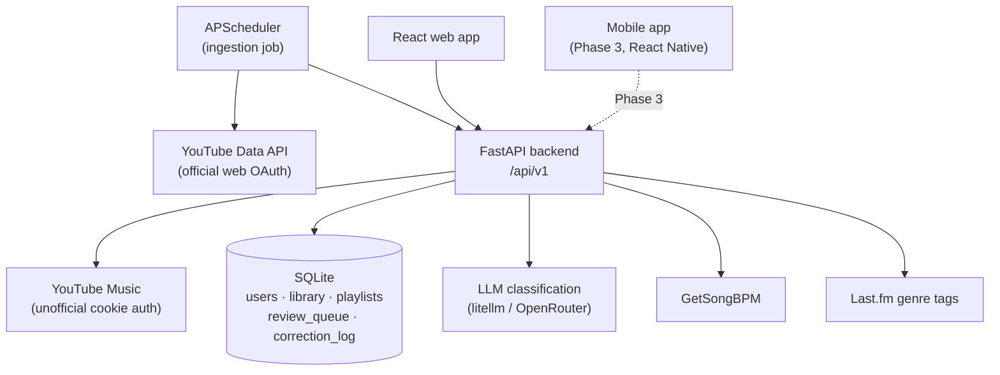
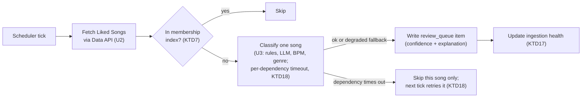

# AI Music Organizer Product - Plan

## Goal Capsule

- **Objective:** Evolve the personal `yt-music-organizer` script into a phased product — a backend + web app (later, native mobile) that organizes YouTube Music likes into existing and AI-generated playlists through an always-review approval flow that learns from corrections over time.
- **Product authority:** This plan owns the core organizing loop and the enhancement layer (BPM, mood/activity, duplicates, cleanup, health, explainability), built for the current user first and architected to generalize to other users later. The life-context/schedule-aware curation vision and support for music services beyond YouTube Music are not active scope here — see How This Work Fits Together.
- **Open blockers:** None. All product-level ambiguity was resolved in dialogue, and the one planning-time architecture question (how backend auth works for a persistent service and a future mobile client) is resolved — see Key Technical Decisions.
- **Execution profile:** This plan's Implementation Units (U1–U9) cover Phase 1 (backend + web app + core organizing/review loop, including onboarding) only, to implementation-ready detail. Phase 2 (enhancement layer) and Phase 3 (mobile) are captured as a Phased Delivery outline, not units — their concrete design depends on decisions and API stability that only emerge from real Phase 1 usage, and detailing them now would invent execution-time decisions before they're knowable.
- **Stop conditions:** Stop and re-plan the auth Key Technical Decisions if the official Data API's server-side web OAuth flow turns out to share the same upstream break as the already-confirmed-broken `ytmusicapi` device-code flow (they are different flows against different Google API surfaces, but this should be verified early in U2, not assumed).
- **Tail ownership:** The implementer owns running the manual live-verification step called out in each unit against the real YouTube Music account — auth flows and actual playlist mutations cannot be meaningfully faked in automated tests.
- **Product Contract preservation:** Unchanged — no scope change. Requirements R1–R22, Actors, Key Flows, and Acceptance Examples keep their original IDs and meaning. Planning-phase findings (research, the auth-architecture resolution, and defaults for gaps found during flow analysis and doc review) are recorded as new Planning Contract Key Technical Decisions (KTD1–KTD25) citing the R-IDs they govern, not as edits to the Requirements text.

---

## Product Contract

### Summary

A phased AI music-organizing product: a backend and web app that sorts YouTube Music likes into existing and AI-suggested playlists through an always-review approval flow with confidence scores and correction-based learning, followed by an enhancement layer (BPM, mood/activity, duplicates, cleanup, health, explainability), followed by a native mobile app. YouTube Music is the only integrated service today, behind a data-source-agnostic backend so other services can be added later without a rewrite.

### Problem Frame

People accumulate hundreds or thousands of liked songs that never get sorted into playlists, because manually maintaining playlists isn't something anyone enjoys doing. This session's own working example makes the shape of the problem concrete: 1,350 liked-but-unsorted songs, only resolved through a one-off script and a manually verified plan — not a repeatable, trustworthy system.

The trust barrier is the real constraint, not the classification technology. An AI that silently reorganizes a library the way a black box would is not something people adopt; the review-and-approve step is what makes automated reorganization safe to hand over.

The foundation this product depends on is also not fully solid: YouTube Music has no supported public API for playlist management. This session hit that directly — the cookie-based auth this integration requires degraded to unusable after a few hours of use, and a separate official OAuth path is broken by a confirmed upstream change with no fix in sight. That risk is accepted for v1 rather than solved, but it is a real constraint on how far "designed to generalize" can go on this backend alone.

### Key Decisions

- **Personal-first, architected to generalize** — validate on the current user's own YouTube Music library first; the account and data model are designed for other users from day one rather than retrofitted later. Governs R2.
- **YouTube Music only, behind a data-source-agnostic backend** — accept the known fragile-auth risk for now instead of delaying for a multi-service rewrite; other services plug into the same abstraction boundary later without one. Governs R1.
- **Always review, no auto-apply, ever** — no confidence threshold bypasses review; every change sits in a pending queue until explicitly approved. The queue is allowed to accumulate rather than forcing a batching mechanism in v1. Governs R11, R12.
- **BPM from a dedicated lookup service, LLM estimate as fallback** — real measured tempo takes priority over inference wherever the song is found in a lookup service (e.g. GetSongBPM-style); LLM estimation only fills gaps. Governs R3.
- **Hybrid rule authoring** — an explicit rule on a playlist (e.g. a BPM range plus a genre match) overrides AI judgment when present; natural-language description plus AI inference decides everything else. Governs R9.
- **Persistent learning from corrections** — every review-time override is logged and fed back as context so future classification of similar songs improves. Governs R15.
- **Client-server architecture over CLI** — the review flow is judged important enough to warrant a backend + web app rather than staying a script with JSON editing; the same API is designed to serve a native mobile client later. Governs R19, R20.
- **Phased delivery: core loop, then enhancement layer, then mobile** — the organizing-plus-review loop is the highest-risk bet and is validated before the enhancement layer and native mobile are built on top of it. Governs R19, R20, R21.

<!-- ce-section: work-relationships -->
### How This Work Fits Together

This plan owns the core organizing product together with its enhancement layer, as one combined build. The broader vision surfaced in this session's brainstorm sketches two more areas, both explicitly deferred — this is the current understanding, not a committed roadmap:

- Life-context / schedule-aware curation (learning the user's weekly rhythm — e.g. Tuesday runs, Friday workouts — and proactively building playlists around it, with integrations like Garmin, Strava, calendar, weather, location)
  - **Depends on:** the core organizing loop and review/trust mechanism this plan builds
  - **Still to decide:** whether this becomes its own product direction or an extension of this one
- Support for other music services (Spotify, Apple Music, Deezer, local libraries)
  - **Enabled by:** the data-source-agnostic backend abstraction this plan requires (R1)
  - **Can proceed independently of:** the enhancement layer, once the abstraction exists

### Actors

- A1. **Primary user** — the sole account today; the account/data model anticipates more users later without redesign.
- A2. **Classification engine** — LLM inference plus optional per-playlist explicit rules plus external data lookups (genre tags, BPM).
- A3. **Music service backend** — YouTube Music today, behind a data-source-agnostic interface.
- A4. **Review interface** — where every pending suggestion is approved, rejected, or reassigned before it touches a playlist.

### Requirements

**Data & Integration**

- R1. The backend integrates with YouTube Music through a data-source-agnostic abstraction; no other service is implemented in this plan, but the abstraction must not require a rewrite to add one.
- R2. The data model isolates each user's library, playlists, and correction history, even though only one user exists at launch.
- R3. BPM/tempo data comes from a dedicated lookup service when the song is found there; when it is not found, the classification engine estimates BPM from its own knowledge and marks that estimate as lower-confidence.
- R4. Genre and mood signals come from song metadata plus LLM inference, carrying forward the existing Last.fm tag lookup already validated in this session.

**Organizing & Classification**

- R5. New liked songs not already present in any playlist are matched against existing playlists by learning what each playlist actually contains, not just its name.
- R6. Users can describe a new playlist in natural language (e.g. "gym music with high energy and strong bass"), and the engine selects matching songs from the library.
- R7. The engine analyzes the whole library and proposes playlists the user doesn't have yet, based on clusters of unplaced or thematically related songs.
- R8. Every suggestion — an addition to an existing playlist, or inclusion in a new one — carries a confidence score.
- R9. A playlist may carry an explicit rule (e.g. a BPM range and a genre match); when a rule exists, only rule-matching songs are suggested for it. When no rule exists, natural-language description plus AI judgment decides.
- R10. Every newly liked song is analyzed automatically and enters the review queue; this is continuous, not a manually triggered batch process.

**Review & Trust**

- R11. No suggestion is ever applied to a playlist without explicit user approval — there is no confidence threshold that bypasses review.
- R12. The review queue accumulates without a forced cadence or reminder in this plan; it is revisited only if usage shows this becomes a problem.
- R13. The user can approve, reject, or move any pending suggestion to a different destination before it is applied.
- R14. Each suggestion shows why the engine placed it there (e.g. matching signals, similarity to existing content).
- R15. Every correction made during review is logged and used as feedback context for future classification of similar songs.

**Enhancement Layer**

- R16. The system detects songs that already exist in more than one playlist.
- R17. The system detects playlists with heavy content overlap and suggests merging them.
- R18. The system surfaces playlist health information (e.g. genre/mood composition, how long since a playlist last changed).

**Platform & Delivery**

- R19. Phase 1 ships a backend and web app covering the Organizing & Classification and Review & Trust requirements above, for YouTube Music only.
- R20. Phase 3 ships a native iOS/Android app built against the same API contract established in Phases 1–2.
- R21. Phase 2 delivers the Enhancement Layer requirements on top of the Phase 1 foundation, before Phase 3 begins.
- R22. The system is built to handle roughly 1,000–5,000 songs efficiently, matching the current user's library size with room to grow.

### Key Flows

- F1. **Continuous new-like organization**
  - **Trigger:** The user likes a new song on YouTube Music.
  - **Actors:** A1, A2, A3
  - **Steps:** The engine detects the new like, checks it isn't already placed anywhere, classifies it against existing playlists and any explicit rules, and adds it to the review queue with a confidence score and explanation.
  - **Covers:** R3, R4, R5, R8, R9, R10, R14
- F2. **Natural-language custom playlist creation**
  - **Trigger:** The user describes a playlist in natural language.
  - **Actors:** A1, A2
  - **Steps:** The engine matches library songs against the description, proposes the set with per-song confidence and explanation, and adds the proposal to the review queue.
  - **Covers:** R6, R8, R14
- F3. **Review and correction**
  - **Trigger:** The user opens the review queue.
  - **Actors:** A1, A4
  - **Steps:** The user approves, rejects, or reassigns each pending item; only approved items are applied to playlists; every reassignment is logged as a correction.
  - **Covers:** R11, R13, R15
- F4. **Playlist health and cleanup pass**
  - **Trigger:** The user requests (or periodically triggers) a library-wide health check.
  - **Actors:** A1, A2
  - **Steps:** The engine scans for duplicates across playlists and playlists with heavy overlap, and surfaces health stats per playlist.
  - **Covers:** R16, R17, R18
- F5. **Onboarding library analysis and new-playlist selection**
  - **Trigger:** First-run onboarding, or the user requests a fresh library analysis.
  - **Actors:** A1, A2, A4
  - **Steps:** The engine clusters unplaced/backlog songs into candidate new-playlist proposals (name, theme, confidence, explanation — not yet populated with songs); the review interface shows the user's existing playlists for context alongside these candidates, and also lets the user add their own custom playlist by natural-language description (R6, reusing U6) at this same step. The user selects which AI-proposed candidates to create and/or adds custom ones; all selected and added playlists become real, empty playlist records. Only after this selection does the backlog classification pass (F1's logic, run once as the onboarding backfill) organize songs across the full set of existing plus newly-created playlists, still through the standard review queue for individual approval.
  - **Covers:** R6, R7, R8, R14

### Acceptance Examples

- AE1. **Covers R3.** Given a song is found in the BPM lookup service, when BPM filtering evaluates it, then the measured BPM is used. Given the song is not found there, then the engine's own estimated BPM is used and flagged as an estimate.
- AE2. **Covers R9.** Given a playlist has an explicit rule, when new songs are evaluated against it, then only rule-matching songs are suggested. Given no rule exists, then natural-language description plus AI judgment decides.
- AE3. **Covers R8, R11.** Given a suggestion has a very high confidence score, when it enters the review queue, then it still requires explicit approval before touching any playlist — confidence never bypasses review.
- AE4. **Covers R15.** Given the user reassigns a suggested song to a different playlist during review, when the engine later classifies a similar song, then the prior correction is used as feedback context.
- AE5. **Covers R7.** Given the library contains a cluster of thematically related unplaced songs, when onboarding/library analysis runs, then a new-playlist proposal (name and theme, no songs yet) for that cluster is shown to the user alongside their existing playlists. Given the user selects that proposal, then an empty playlist record is created and only afterward is backlog classification run to populate it and other playlists through the review queue.

### Success Criteria

- Review sessions trend toward approving suggestions as-is, with corrections becoming the exception rather than the norm.
- New liked songs stay organized without the user manually maintaining playlists, even though every change still passes through review.
- The system surfaces playlists or clusters the user would not have organized manually (e.g. a thematic cluster the user hadn't noticed).

### Scope Boundaries

**Deferred for later:**

- Life-context / schedule-aware curation and its integrations (Garmin, Strava, calendar, weather, location) — see How This Work Fits Together.
- Support for music services beyond YouTube Music (Spotify, Apple Music, Deezer, local libraries) — the backend abstraction (R1) must not block this, but none are implemented in this plan.
- Billing/subscription infrastructure — per-user data isolation is designed in (R2) in case this becomes a hosted product later, but no payment or subscription system is built here.

### Dependencies / Assumptions

- YouTube Music's playlist API is unofficial and reverse-engineered; the cookie-based auth this integration depends on is known to degrade after hours of heavy use. This risk is accepted, not eliminated, by this plan — KTD4 and KTD6 add a reconnect mechanism and a visible health state instead of the current code's silent blind-retry behavior.
- The official YouTube Data API's existing local-server OAuth flow cannot run in a headless backend or from a remote mobile client; KTD4 replaces it with a standard server-side web OAuth redirect. This is a distinct flow from the separate, already-confirmed-broken `ytmusicapi` device-code OAuth (see Stop Conditions in the Goal Capsule).
- Genre-tag enrichment via Last.fm's `artist.getTopTags` is already validated working in this session (`lastfm.py`).
- GetSongBPM (KTD9) is confirmed active with a 3,000 requests/hour rate limit and a mandatory attribution backlink/credit.
- Spotify's own audio-features endpoint is deprecated for any app registered after 2024-11-27, with no official replacement — relevant if Spotify is later added as a data source, since it will not be usable for BPM/tempo data either.
- LLM-based classification (title/artist/genre-tag input, structured output) is already validated working in this session's script (`llm.py`) and is assumed viable as the classification engine's foundation.

### Sources / Research

- `organize_music.py`, `llm.py`, `lastfm.py`, `youtube_data_api.py` — the existing script; its classification logic (existing-playlist matching, LLM clustering, artist-name normalization, Last.fm genre tags) is the foundation Phase 1 builds from. `organize_music.py`'s `with_retries` (blind retry on any exception) and `youtube_data_api.py`'s `run_local_server` OAuth call are the two pieces U2 replaces rather than ports.
- [GetSongBPM API](https://getsongbpm.com/api) — free artist+title BPM/key lookup (KTD9), confirmed active with a 3,000 req/hour limit and mandatory attribution.
- Spotify Community forum threads confirming the `/v1/audio-features` and `/v1/audio-analysis` endpoints are deprecated for apps registered after 2024-11-27, with no official replacement.
- [zhanymkanov/fastapi-best-practices](https://github.com/zhanymkanov/fastapi-best-practices) and [FastAPI Best Practices 2026](https://pratikpathak.com/fastapi-best-practices-building-production-ready-python-apis-in-2026/) — project structure and versioning guidance behind KTD2, KTD3.
- [Flightcontrol's multi-tenant data modeling guide](https://www.flightcontrol.dev/blog/ultimate-guide-to-multi-tenant-saas-data-modeling) — the `user_id`-FK-from-day-one, defer-real-auth pattern behind KTD2.
- [Better Stack's APScheduler guide](https://betterstack.com/community/guides/scaling-python/apscheduler-scheduled-tasks/) and [GitHub APScheduler discussion #1088](https://github.com/agronholm/apscheduler/discussions/1088) — single-process scheduling and the multi-worker duplicate-job pitfall behind KTD5.
- [Comet's HITL review workflow guide](https://www.comet.com/site/blog/human-in-the-loop/) and [Red Gate: Database Design for Audit Logging](https://www.red-gate.com/blog/database-design-for-audit-logging/) — the review-queue-plus-audit-log shape behind KTD8.
- [React Native in 2026: Trends](https://blog.swmansion.com/react-native-in-2026-trends-our-predictions-463a837420c7) and [Expo new architecture docs](https://docs.expo.dev/guides/new-architecture/) — the mobile-framework recommendation behind KTD16.

---

## Planning Contract

### Key Technical Decisions

**Architecture & Data**

- KTD1. **FastAPI backend + React web frontend** (session-settled: user-directed — chosen over staying CLI+JSON or a static-report hybrid: review UX was judged too important to stay script-based, and a future mobile client needed a real API). Governs R19, R20.
- KTD2. **SQLite via SQLAlchemy/SQLModel + Alembic, single default `user_id` row** — the lightest credible per-user-isolation shape without premature auth infrastructure; the ORM and migrations de-risk a later Postgres cutover, which happens only once real concurrent multi-user writes appear rather than starting on Postgres now. Governs R2, R22.
- KTD3. **Path-based API versioning from `/api/v1/`** — the standard, mobile-safe default; removes the biggest later-breakage risk given the Phase 3 mobile app builds directly against this contract. Governs R20.

**Ingestion & Auth**

- KTD4. **Server-side web OAuth for the official Data API, plus a manual reconnect page for the cookie auth** (session-settled: user-directed — chosen over keeping both mechanisms CLI-only, or fixing only the OAuth detection path: a persistent backend and a remote mobile client can't rely on a local-server browser popup, and "stays organized automatically" requires an in-app reconnect path rather than a CLI chore).
- KTD5. **APScheduler + `SQLAlchemyJobStore` in a single dedicated process** for continuous ingestion — persists schedule state across restarts; defers Celery/ARQ until real concurrent multi-user ingestion load exists. Governs R10.
- KTD6. **System-level ingestion/auth health status**, distinct from per-playlist health (R18) — surfaces "ingestion paused since X — reconnect" instead of silent failure; approved-but-unapplied queue items are held, not lost, until write-auth is restored. Governs R10.
- KTD7. **Incremental membership index for "already placed" tracking** — replaces the existing script's full-library recompute-per-run with a persisted high-water-mark, so continuous per-like ingestion doesn't rescan the whole library on every event. Governs R10.
- KTD17. **Ingestion/detection health (OAuth) and write health (cookie auth) are two independently surfaced states, never blended into one signal** — a stalled detection path and a degraded write path need distinguishable reconnect actions, and hard OAuth-token revocation (not just expiry) gets its own manual-reconnect affordance rather than relying solely on refresh. Extends KTD6. Governs R10.
- KTD18. **Per-dependency timeout and circuit-breaking in the classification hot path** (LLM, Last.fm, GetSongBPM) — a slow or failing external call fails only that song's classification for the current tick, never blocks detection of every other new like. A rate-limited or degraded response (not just a clean miss) is surfaced through KTD17's health status, not silently treated as "not found." Governs R10.

**Classification & Review Semantics**

- KTD8. **`review_queue` + `correction_log` two-table schema** — status as a constrained value (not a native ENUM type) for easy evolution; `correction_log` is append-only and the source for future few-shot examples. Governs R8, R11–R15.
- KTD9. **GetSongBPM as the BPM/tempo lookup service** — confirmed active, free, artist+title lookup; a 3,000 req/hour rate limit and a mandatory attribution credit in the UI are accepted terms. Governs R3.
- KTD10. **Rule + description precedence** — when a playlist carries both an explicit rule and a natural-language description, the rule is a hard gate and the description is not used for candidacy on that playlist, surfaced in the R14 explanation text. Governs R9.
- KTD11. **Natural-language playlist descriptions persist on the playlist record** — otherwise the "stays organized automatically" success criterion would silently fail for AI-created playlists after their first batch. Governs R6, R10.
- KTD12. **Corrections shape only future classification, never retroactively re-evaluate other pending queue items** — avoids a confusing "why did this change while I wasn't looking" experience; feedback is bounded to recent corrections in the same genre/artist cluster. Governs R15.
- KTD13. **Optimistic concurrency on `review_queue` items** (a status/version field) rather than real-time sync — sufficient for a single actor occasionally using two clients; avoids realtime infrastructure this scale doesn't need. Governs R11, R13.
- KTD14. **Stale queue items** — if a song is unliked or removed before review, the next ingestion pass marks its queue item stale/invalid rather than allowing approval of a song that's no longer there. Governs R11, R13.
- KTD15. **Merge/duplicate actions are a current leaning to route through the same `review_queue` and `correction_log`** as song-to-playlist suggestions, for consistency and auditability — not a locked decision. Per YAGNI, Phase 2's own planning pass confirms or revises this once Phase 1's schema has been proven in real use, consistent with Phase 2 being intentionally left undefined below. Governs R16, R17.
- KTD19. **Every write to a `review_queue` row — a user action or the ingestion job's staleness marking (KTD14) — is a compare-and-swap on `(id, version)`; a version mismatch always returns a conflict, never a silent overwrite.** This closes the race KTD13 only covered for two user actions: the ingestion job is a second writer to the same table and must follow the same invariant. Governs R11, R13.
- KTD20. **`correction_log` immutability is enforced at the database layer**, not left as an ORM convention — it is the source of truth for the correction-feedback loop (KTD12), so an unenforced accidental update or delete would silently corrupt future classification with no error surfaced. Governs R15.
- KTD21. **The initial backlog is processed as a separate, rate-limited backfill strategy, distinct from steady-state per-like ticks** — the existing 1,350-song already-liked backlog this session's script left unsorted would otherwise burst through GetSongBPM's 3,000 req/hour ceiling (KTD9) with no throttling on day one. Governs R10, R22.

**Mobile**

- KTD16. **React Native + Expo is the current research-backed leaning for the Phase 3 mobile app** — chosen over Flutter or platform-native for code/skill reuse with the React web codebase and mature 2026 tooling (New Architecture default, EAS Build/Update), but treated as revisitable rather than locked: per YAGNI, Phase 3 detail stays deferred until Phase 1's API contract has stabilized through real usage. Governs R20.

**Deployment**

- KTD22. **The APScheduler ingestion job's single-process constraint is a deployment topology requirement, not an assumption** — enforced via a pinned replica count and a startup check that reports scheduler-instance identity, so an accidental second instance fails loudly instead of double-firing the job silently. A DB row-level advisory lock is the stated escalation path if ingestion ever needs to scale horizontally, but is not built in Phase 1 — YAGNI until real horizontal-scaling need appears. Extends KTD5.
- KTD26. **Docker Compose is the Phase 1 run topology for every service — backend and web alike** (session-settled: user-directed) — each gets its own Dockerfile, orchestrated by one root `docker-compose.yml` with a named volume for the SQLite data file so it persists across container restarts; `backend`'s replica count stays pinned at 1 in compose to hold KTD22's single-process ingestion constraint. This is the one way to run the stack in Phase 1 — no bare-metal `uvicorn`/`vite` run path is separately maintained. Governs R19, R20, R22.

**Code Organization & Principles**

- KTD23. **A repository module per domain entity (users, playlists, review queue items, correction log, library items) is the only layer that issues ORM queries** — services (classification, review queue, library analysis) call repositories, never SQLAlchemy/SQLModel directly. This is the service-repository split: it keeps business logic unit-testable without a live database, and confines the eventual Postgres cutover (KTD2) to the repository layer alone rather than every call site. Governs R2, R11–R15.
- KTD24. **A single shared HTTP client wrapper (timeout, retry, circuit-breaking) is used across every external integration** — YouTube Music, the Data API, the LLM provider, Last.fm, and GetSongBPM alike — rather than a bespoke implementation per client. KTD18's per-dependency isolation in the classification hot path is one application of this shared wrapper, not a separate implementation, avoiding five near-duplicate retry implementations. Governs R1, R10.
- KTD25. **The data-source-agnostic backend abstraction (R1) is a concrete dependency-inversion boundary**: classification and review-queue logic depend on a `MusicServiceClient` interface, never on `ytmusicapi` directly. Adding a second music service later means writing a new adapter behind that interface, not touching existing business logic. Governs R1.

### High-Level Technical Design

**Component topology**



**Ingestion data flow (F1, U4)**



**Review queue item lifecycle (U5)**

```mermaid
stateDiagram-v2
  [*] --> pending
  pending --> write_pending: approve or move (calls YTM write path)
  write_pending --> approved: approve write succeeds
  write_pending --> moved: move write succeeds
  write_pending --> pending: write fails (KTD17 health raised; item held per KTD6, not lost)
  pending --> rejected: reject
  pending --> stale: source song unliked (KTD14, synchronous check at approve-time)
  approved --> [*]
  moved --> [*]
  rejected --> [*]
  stale --> [*]
```



### Output Structure

```
docker-compose.yml
backend/
  Dockerfile
  app/
    main.py
    core/
      config.py
    api/v1/
      __init__.py
      review_queue.py
      playlists.py
      onboarding.py
      auth_status.py
    integrations/
      base.py
      ytmusic_client.py
      youtube_data_api_client.py
      auth_status.py
      http_client.py
    services/
      classification.py
      genre_lookup.py
      bpm_lookup.py
      review_queue.py
      library_analysis.py
    repositories/
      user_repository.py
      playlist_repository.py
      review_queue_repository.py
      correction_log_repository.py
      library_repository.py
    jobs/
      scheduler.py
      ingestion.py
    models/
  alembic/
  tests/
web/
  Dockerfile
  src/
    pages/
      Onboarding.tsx
      ReviewQueue.tsx
      Settings.tsx
    api/
      client.ts
  tests/
```

### System-Wide Impact

- **Two independent auth failure domains must never blend into one signal.** The write path (cookie auth) and the detection path (OAuth) fail independently; a blended health status would point the user at the wrong reconnect flow, or hide a stalled detection path behind an idle-looking queue. KTD17 makes both states explicit and independently surfaced; U2 and U8 implement this.
- **A single slow or failing classification dependency must not stall detection of every other new like.** The continuous ingestion job (U4) runs in one dedicated process (KTD5); without per-dependency isolation, one hung call to the LLM, Last.fm, or GetSongBPM would block the whole tick. KTD18 scopes failure to the one song being classified.
- **The review queue's "backend decides / user decides" seam must never leave an item in an ambiguous state.** Approval and move both perform an external write; on failure, the item must return to `pending` rather than being silently left as if applied. The lifecycle diagram above adds a `write_pending` state (KTD17) and KTD19's compare-and-swap invariant to close this gap.
- **The credential and scheduler layers are single-tenant today even though the data model is not.** KTD2's per-`user_id` schema isolates data cleanly, but U2's auth wrappers and U4's scheduler both assume one YouTube account and one ingestion cadence. Adding a second real user would need per-user credential storage and per-user scheduling before the schema's isolation is actually usable — this plan does not build that, but a future multi-user pass should target the credential/scheduler layer, not re-litigate KTD2's schema.

### Risks & Dependencies

- **SQLite's permissiveness can mask bugs that only surface at the Postgres cutover.** SQLite doesn't enforce foreign keys by default and has no real column type enforcement; U1 requires enabling foreign-key enforcement and DB-level status constraints now so the eventual Postgres migration (KTD2) doesn't surface latent integrity bugs for the first time in production.
- **`correction_log`'s append-only guarantee is currently a convention, not an enforced constraint.** Since U7's feedback loop treats it as ground truth, an unenforced accidental update or delete would silently corrupt future classification. KTD20 requires DB-level enforcement, not just ORM discipline.
- **Running the ingestion scheduler under multiple worker processes would silently double-fire every job.** This is a known class of APScheduler pitfall, not a hypothetical: KTD22 requires the single-process constraint to be a deployment-topology guarantee (pinned replica count, a startup identity check) rather than an assumption that could quietly break under a future deployment change.
- **The existing 1,350-song backlog is a burst risk against GetSongBPM's rate limit, not just steady-state traffic.** Steady-state per-like ingestion is low-volume and not a bottleneck at this project's scale (R22). The risk is the first-run backfill of the existing backlog, which KTD21 requires to run as its own rate-limited pass rather than bursting through the classification path all at once.

---

## Implementation Units

### U1. Backend scaffolding & data model

- **Goal:** Stand up the FastAPI app skeleton with versioned routing, typed settings, and the core data model.
- **Requirements:** R2, R19, R22
- **Dependencies:** None
- **Files:** `backend/app/main.py`, `backend/app/core/config.py`, `backend/app/api/v1/__init__.py`, `backend/app/models/`, `backend/app/repositories/`, `backend/alembic/`, `backend/tests/test_app_boots.py`, `backend/Dockerfile`, `docker-compose.yml`
- **Approach:** SQLModel models with a `user_id` FK on every domain table, scoped to a single default user row (KTD2); Alembic migration baseline; Pydantic Settings for env-driven config; mount the `/api/v1` router (KTD3). Build the schema Postgres-compatible from this first migration, since KTD2 defers the Postgres cutover rather than avoiding it: enable foreign-key enforcement explicitly (off by default in SQLite), give `review_queue.status` a DB-level constrained-value check rather than app-only validation (KTD8), make every timestamp column timezone-aware, and use a portable JSON column type for explanation/context fields rather than SQLite-specific JSON functions. Scaffold one repository module per domain entity in `repositories/` (KTD23) as the only place later units may issue ORM queries. Write `backend/Dockerfile` and the root `docker-compose.yml` in this unit, since every other unit runs against the compose topology from here on (KTD26): a `backend` service (replica count pinned at 1) running `alembic upgrade head` then `uvicorn`, a named volume mounting the SQLite file so it survives container restarts, and a `web` service stub (built out fully in U8) so `docker compose up` brings up the whole stack from the first commit.
- **Test scenarios:**
  - App boots and responds on a health endpoint.
  - Migrations apply cleanly from an empty database.
  - Every domain table enforces a non-null `user_id`.
  - A foreign-key violation is rejected, not silently accepted.
  - An invalid `review_queue.status` value is rejected by the database, not only by application code.
  - A repository method is exercised directly in a test without going through any service or API layer, confirming the repository layer is independently usable (KTD23).
- **Verification:** `pytest` passes; `alembic upgrade head` succeeds against a fresh SQLite file; `docker compose up` brings up `backend` and it responds on its health endpoint.

### U2. YouTube Music + Data API integration layer

- **Goal:** Wrap both YouTube auth mechanisms as backend services with two independently surfaced health/reconnect states.
- **Requirements:** R1, R5, R10
- **Dependencies:** U1
- **Files:** `backend/app/integrations/base.py`, `backend/app/integrations/ytmusic_client.py`, `backend/app/integrations/youtube_data_api_client.py`, `backend/app/integrations/auth_status.py`, `backend/app/integrations/http_client.py`, `backend/tests/test_integrations.py`
- **Approach:**
  - Define the `MusicServiceClient` interface in `base.py` (KTD25); `ytmusic_client.py` is its sole implementation for now, so adding a second music service later is a new adapter, not a change to classification or review-queue logic.
  - Port `organize_music.py`'s playlist/track fetch and `artist_bucket_key` normalization as service functions behind that interface.
  - Replace `youtube_data_api.py`'s `run_local_server` OAuth call with the server-side web OAuth redirect (KTD4).
  - Both clients use the shared HTTP wrapper (`http_client.py`, KTD24) for timeout/retry rather than each rolling its own.
  - Add an auth-status service reporting the write path (cookie auth) and the detection path (OAuth) as two separate named states — "ok" / "needs reconnect" each — per KTD17, replacing the current blind-retry-on-any-exception behavior. A revoked (not just expired) OAuth token surfaces its own manual-reconnect affordance, since refresh alone cannot recover it.
- **Patterns to follow:** `organize_music.py`'s `artist_bucket_key` normalization; `youtube_data_api.py`'s music-category (`categoryId == "10"`) filter.
- **Test scenarios:**
  - A mocked cookie-auth failure flips the write-path status to needs-reconnect rather than retrying blindly.
  - A mocked OAuth token expiry triggers a refresh.
  - A mocked OAuth token revocation (refresh itself fails) flips the detection-path status to needs-reconnect, distinct from the write-path status.
  - The category filter excludes a non-music liked video.
  - `artist_bucket_key` normalizes a known VEVO-suffix channel-name variant to the same key as the plain artist name.
- **Verification:** `pytest` passes against mocked clients; one manual live check against the real YouTube Music/Data API account.

### U3. Classification service

- **Goal:** Wrap and extend the existing LLM/genre/BPM logic with confidence, explanation, rule precedence, and per-dependency resilience.
- **Requirements:** R3, R4, R6, R7, R8, R9, R14
- **Dependencies:** U1, U2
- **Files:** `backend/app/services/classification.py`, `backend/app/services/genre_lookup.py`, `backend/app/services/bpm_lookup.py`, `backend/tests/test_classification.py`
- **Approach:**
  - Extend `llm.py`'s structured-output schemas with `confidence` and `explanation` fields.
  - Move `lastfm.py`'s file cache to a DB-backed cache via U1's repository layer (KTD23) rather than direct queries in the service.
  - Add BPM lookup: GetSongBPM primary, LLM-estimate fallback flagged per R3 (KTD9).
  - Implement the rule-vs-description precedence gate (KTD10) ahead of classification.
  - All three external calls (LLM, Last.fm, GetSongBPM) go through U2's shared HTTP wrapper (KTD24) for timeout handling, not a bespoke implementation per call; a timeout or rate-limit response on one call fails only that song's classification for the current tick and is reported through KTD17's health status, never treated as a silent "not found" (KTD18).
- **Test scenarios:**
  - Every suggestion carries a confidence score.
  - A BPM lookup hit returns the measured value; a miss falls back to a flagged LLM estimate. **Covers AE1.**
  - A rate-limited or timed-out BPM lookup is distinguishable from a genuine miss and surfaces a degraded-health signal rather than silently falling back. **Covers AE1.**
  - A rule-gated playlist ignores a description-only match. **Covers AE2.**
  - The explanation text names the matching signal (rule, artist similarity, or description match).
  - A single song's classification timeout does not block the calling ingestion tick from processing the next song.
- **Verification:** `pytest` passes; a golden-set of the existing script's known-good clusters (e.g. the Aurora and Attack on Titan cases verified earlier this session) still classify correctly.

### U4. Continuous ingestion job

- **Goal:** Replace the script's full-library-recompute with a scheduled, incremental ingestion pipeline, plus a bounded backfill for the existing backlog. **Realizes F1.**
- **Requirements:** R10, R22
- **Dependencies:** U1, U2, U3, U9
- **Files:** `backend/app/jobs/ingestion.py`, `backend/app/jobs/scheduler.py`
- **Approach:**
  - Poll U2's Data API client on a schedule, running in a single dedicated process with a startup identity check that fails loudly if a second scheduler instance is detected (KTD22).
  - Diff against U1's incremental membership index (KTD7) instead of recomputing the full library; classify new songs via U3; write `review_queue` rows through the repository layer (KTD23) via a compare-and-swap on `(id, version)` (KTD19); surface ingestion health via KTD17.
  - Process the existing, already-liked backlog as a separate rate-limited backfill pass, distinct from steady-state per-like ticks, respecting GetSongBPM's 3,000 req/hour ceiling (KTD21). This backfill pass does not start until U9's onboarding playlist selection has completed, since it classifies against the playlist set U9 finalizes; steady-state per-like ticks are suspended until the first backfill pass finishes, so the two never race the same backlog songs.
- **Execution note:** Add characterization coverage for the incremental-diff logic before wiring the scheduler — this is the piece with no precedent in the existing script.
- **Test scenarios:**
  - A new liked song not yet in the membership index produces exactly one queue item.
  - An already-placed song produces none.
  - A scheduler restart resumes without reprocessing already-seen songs.
  - The backfill pass processes the existing backlog without exceeding GetSongBPM's rate limit, and resumes correctly if interrupted partway through.
  - An ingestion-job write (staleness marking, KTD14) racing a concurrent user action on the same queue row results in a version conflict, never a silent overwrite (KTD19).
- **Verification:** `pytest` passes against a mocked scheduler tick; one manual live run against the real account, including the first-run backfill.

### U5. Review queue API

- **Goal:** Expose the review queue as a mutable, per-item API, replacing `plan.json`/`apply_plan`. **Realizes F3.**
- **Requirements:** R11, R12, R13, R14, R15
- **Dependencies:** U1, U2, U3
- **Files:** `backend/app/api/v1/review_queue.py`, `backend/app/services/review_queue.py`, `backend/tests/test_review_queue_api.py`
- **Approach:**
  - List/approve/reject/move endpoints; approve and move both transition an item to a held `write_pending` state before calling U2's write path for exactly one item (never a full-file replay); on write failure the item returns to `pending` and KTD17's health status is raised, rather than the item being left stuck as if applied.
  - Re-validate source liveness synchronously at approve/move time (not solely relying on the next ingestion tick's staleness pass, KTD14) so a race between a paused scheduler and a user action can't approve a song that's already gone.
  - The service calls the review-queue and correction-log repositories (KTD23) for every read/write, never the ORM directly. Every reassignment writes a `correction_log` row (KTD8, append-only enforced at the DB layer per KTD20); every write is a compare-and-swap on `(id, version)` per KTD19, covering both user actions and the ingestion job as writers.
  - Merge/duplicate actions from the future enhancement layer are expected to route through this same API (KTD15).
- **Test scenarios:**
  - Approve transitions through `write_pending` and applies exactly one playlist mutation on success. **Covers AE3.**
  - A write failure during approve returns the item to `pending` rather than leaving it stuck, and raises the health status.
  - Reject leaves the playlist untouched and logs no correction.
  - Move logs a correction with the old and new destination.
  - A second action against an already-resolved item returns a conflict instead of double-applying.
  - A high-confidence suggestion still requires the same explicit approval step as a low-confidence one. **Covers AE3.**
  - A stale item (source song no longer liked, checked synchronously at approve-time) is surfaced as such rather than approvable.
- **Verification:** `pytest` passes; one manual approval verified against the real YouTube Music account.

### U6. Natural-language playlist creation endpoint

- **Goal:** Let the user describe a playlist and get a reviewable proposal. **Realizes F2.**
- **Requirements:** R6, R8, R9, R14
- **Dependencies:** U1, U3, U5
- **Files:** `backend/app/api/v1/playlists.py`, `backend/tests/test_playlist_creation.py`
- **Approach:** Accept a description, persist it on the playlist record (KTD11) so U4's ingestion keeps matching future likes against it; run initial matching via U3; create `review_queue` items via U5's service layer.
- **Test scenarios:**
  - A description persists and is retrievable after creation.
  - A subsequent ingestion pass matches a new song against the persisted description.
  - A rule-gated playlist ignores the description per KTD10. **Covers AE2.**
- **Verification:** `pytest` passes; one manual creation verified end-to-end.

### U7. Correction-feedback loop

- **Goal:** Feed logged corrections back into future classification calls.
- **Requirements:** R15
- **Dependencies:** U3, U5
- **Files:** `backend/app/services/classification.py` (extended), `backend/tests/test_feedback_loop.py`
- **Approach:** Query `correction_log` for recent corrections in the same genre/artist cluster (bounded to a fixed recent-N) and pass them as few-shot context to U3's classification calls (KTD12); never mutate other pending queue items when a correction lands; `correction_log` immutability (KTD20) is enforced at the database layer, not just by convention.
- **Test scenarios:**
  - A logged correction changes the classification of a subsequently-processed similar song. **Covers AE4.**
  - An already-pending unrelated queue item is untouched by a new correction.
  - An attempted update or delete against an existing `correction_log` row is rejected by the database.
- **Verification:** `pytest` passes on a scripted before/after classification comparison; a verification query confirms `correction_log` row count is monotonically non-decreasing.

### U8. Web review UI

- **Goal:** Ship the React app that makes review actually pleasant.
- **Requirements:** R11, R13, R14, R19
- **Dependencies:** U2, U5, U6
- **Files:** `backend/app/api/v1/auth_status.py`, `web/src/pages/ReviewQueue.tsx`, `web/src/pages/Settings.tsx`, `web/src/api/client.ts`, `web/tests/`, `web/Dockerfile`, `docker-compose.yml`
- **Approach:** Queue view grouped by destination playlist, with confidence and explanation per item and approve/reject/move controls; two independent connection-health banners (write path and detection path) exposed via a dedicated `auth_status` API route reading U2's health service (KTD17), each naming which reconnect flow applies; a GetSongBPM attribution credit per KTD9's terms; a natural-language playlist creation form calling U6. Flesh out the `web` service stub U1 added to `docker-compose.yml` (KTD26) into a real Dockerfile — dev-mode hot reload against the `backend` service by container DNS name, not `localhost`.
- **Test scenarios:**
  - Approving an item removes it from the visible queue.
  - A write-path reconnect banner appears when U2 reports the cookie auth degraded, distinct from a detection-path banner for a degraded OAuth state.
  - The attribution credit renders on any page showing BPM data.
- **Verification:** Component tests pass; `docker compose up` brings up `web` and `backend` together and the queue view loads against the live backend API; one manual pass reviewing real queue items end-to-end in a browser.

### U9. Onboarding library analysis & new-playlist proposals

- **Goal:** Give R7 a concrete implementation: analyze the whole library once at onboarding (or on demand) and propose new playlists from clusters of unplaced songs, shown alongside the user's existing playlists. **Realizes F5.**
- **Requirements:** R7, R8, R14
- **Dependencies:** U1, U3, U6
- **Files:** `backend/app/api/v1/onboarding.py`, `backend/app/services/library_analysis.py`, `web/src/pages/Onboarding.tsx`, `backend/tests/test_library_analysis.py`
- **Approach:**
  1. Reuse U3's classification service's batched library-wide clustering (the existing script's `suggest_playlists` batching, not the per-song ingestion path) to group unplaced/backlog songs into candidate new-playlist proposals — name, theme, confidence, explanation, no songs attached yet.
  2. List the user's existing playlists for context alongside the candidates, and expose U6's natural-language creation form on the same screen so the user can add their own custom playlist by description instead of, or alongside, the AI-proposed candidates.
  3. On the user's selection, create an empty playlist record for each accepted candidate and each custom addition. Rejected candidates create nothing.
  4. Only after selection completes does U4's backfill classification run, against the full set of existing plus newly-created playlists — this unit does not classify or attach songs itself; it only decides which playlists exist before U4 does.
- **Test scenarios:**
  - A cluster of thematically related unplaced songs produces at least one new-playlist proposal. **Covers AE5.**
  - Existing playlists are shown for context but are not modified by this flow.
  - Selecting a proposed candidate creates an empty playlist record, with no songs attached, rather than adding them directly. **Covers AE5.**
  - Adding a custom playlist by description during onboarding creates an empty playlist record the same way an accepted candidate does.
  - Rejecting a proposed candidate creates nothing.
  - U4's backfill does not start classifying until onboarding selection has completed.
- **Verification:** `pytest` passes; one manual run against the real existing backlog producing recognizable clusters and a working custom-description addition.

---

## Phased Delivery

- **Phase 2 — Enhancement Layer** (after Phase 1 ships and sees real use): duplicate detection (R16), playlist cleanup/merge suggestions (R17) routed through the review queue per KTD15, playlist health stats (R18), and explanation-quality refinements (R14). Each becomes its own planning pass once Phase 1's schema and API have been proven in real use — implementation units are intentionally not defined here, to avoid inventing detail that depends on Phase 1 outcomes.
- **Phase 3 — Mobile** (React Native + Expo, KTD16): a native client built directly against the versioned API (KTD3) established in Phases 1–2. Requires the API contract to have stabilized through real Phase 1 usage first.

---

## Verification Contract

| Scope | Command | Applies to |
|---|---|---|
| Backend unit/integration tests | `pytest` (from `backend/`) | U1–U7, U9 |
| Backend migration check | `alembic upgrade head` against a fresh SQLite file, with FK enforcement and status constraint verified | U1 |
| Data integrity check | Verification query confirming `correction_log` row count is monotonically non-decreasing | U7 |
| Frontend component tests | `npm test` (Vitest + React Testing Library) | U8, U9 |
| Manual live verification | One approve/reject/move cycle completed end-to-end in the browser, against the real YouTube Music account, including a first-run onboarding + backfill pass and one natural-language playlist creation | U2, U4, U5, U6, U8, U9 |
| Full-stack smoke | `docker compose up` brings up `backend` and `web` together, backend health endpoint responds, web loads against it (KTD26) | U1, U8 |

---

## Definition of Done

- All Phase 1 units (U1–U9) implemented and merged.
- `pytest` (backend) and the frontend test suite both green.
- `alembic upgrade head` applies cleanly from an empty database, with foreign-key enforcement and the `review_queue.status` constraint both verified active (KTD2, U1).
- A verification query confirms `correction_log` is append-only in practice (row count never decreases, no update timestamps on existing rows) (KTD20, U7).
- Both auth mechanisms (cookie auth and the new web OAuth flow) verified live against the real account, including both independently-surfaced reconnect/needs-reconnect states (KTD17).
- Onboarding produces at least one recognizable new-playlist proposal from the real backlog, and a custom-description playlist can be added from the same screen (R6, R7, U9).
- The first-run backfill of the existing liked-songs backlog completes without exceeding GetSongBPM's rate limit, and only after onboarding selection is complete (KTD21, U4, U9).
- The GetSongBPM attribution credit is visible in the web app.
- Each unit's test scenarios pass and its manual verification step (where specified) has been completed at least once against the real account.
- No dead or experimental code remains from approaches explored and abandoned during implementation.
