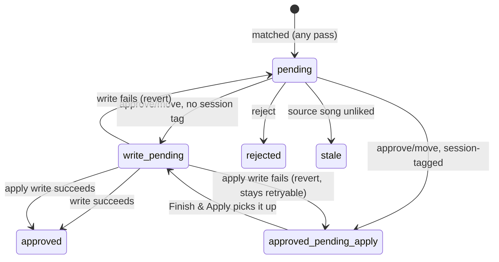
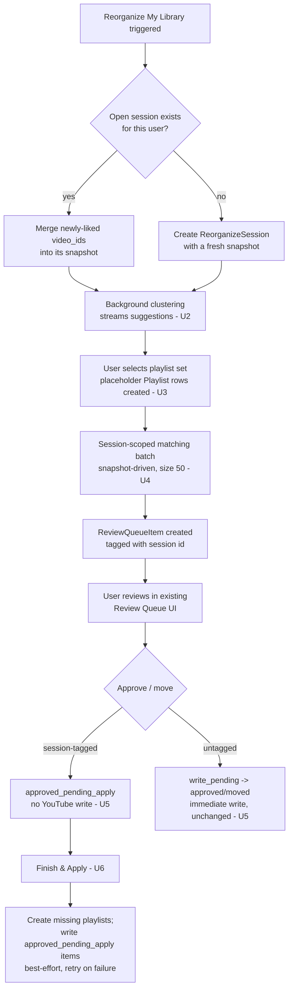

# Reorganize Library Flow - Plan

## Goal Capsule

- **Objective:** Design and implement a repeatable "Reorganize My Library" flow that fetches the user's complete liked-songs library, streams AI playlist-cluster suggestions progressively, matches the full library through the existing Review Queue, and defers all playlist creation and song-adding to an explicit "Finish & Apply" step.
- **Product authority:** This plan owns the reorganize flow's product behavior and its implementation — playlist selection, suggestion streaming, reuse of the existing Review Queue, deferred commit, and partial apply. It does not own the classification/matching algorithm itself (already covered by the original product plan and this session's earlier fixes), and it does not change the day-to-day lightweight ingestion loop for songs liked outside a reorganize session.
- **Open blockers:** None — every product fork was resolved in dialogue (see Key Decisions); every planning-time technical fork found during flow analysis is resolved below (see Key Technical Decisions).
- **Execution profile:** Seven Implementation Units (U1–U7): schema/model foundation, background suggestion clustering, playlist-selection persistence, session-scoped full-library matching, deferred-write approve/move, Finish & Apply, and the frontend integration — in that dependency order.
- **Stop conditions:** None identified beyond the per-unit test gates.
- **Tail ownership:** The implementer runs the full backend and frontend test suites after each unit, plus the manual live-account walkthrough called out in U2, U6, and U7 — background jobs and actual YouTube playlist mutations cannot be meaningfully faked in automated tests.
- **Product Contract preservation:** Unchanged — no scope change. Requirements R1–R12, Key Decisions, Key Flow F1, and Acceptance Examples AE1–AE4 keep their original meaning and IDs. The Product Contract's two "Deferred to Planning" Outstanding Questions are resolved below as KTD2 and KTD3 respectively; they are removed from Outstanding Questions accordingly.

---

## Product Contract

### Summary

A repeatable "Reorganize My Library" action fetches the user's entire liked-songs library, streams AI-clustered new-playlist suggestions in progressively as batches complete, and lets the user select which existing, adopted, suggested, or custom playlists to manage. Matching the full library against that selection then runs through the existing 50-song-batch Review Queue. Approving an item inside an active reorganize session only finalizes the decision locally; a "Finish & Apply" step creates any missing playlists and writes every approved song to them in one pass, applying whatever has been decided so far.

### Problem Frame

Today, the onboarding screen only sees whatever has already been pulled into the local database in ad hoc 50-song batches — a tiny, arbitrary slice of a much larger liked-songs library — and it can never be re-run to benefit from further processing once completed. This session's own account hit that directly: new-playlist suggestions came back empty or artist-based because only 50 of a much larger library had been ingested, and improving suggestion quality meant repeatedly re-triggering ad hoc batches with no single point to review, adjust, and then commit.

Separately, every Review Queue approval writes to YouTube immediately. For a large one-time reorganization pass, that means there is no way to review a big batch of matches and change earlier decisions before anything actually ships to the real library.

### Requirements

**Reorganize entry & scope**
- R1. A "Reorganize My Library" action is available at any time, not gated to first-time use, and can be re-run across multiple sessions over time.
- R2. Triggering it fetches the user's complete current liked-songs library from YouTube Music, not just previously-ingested items.
- R3. AI playlist-cluster suggestions are generated and shown progressively in batches as each batch completes, rather than blocking on the entire library clustering before showing anything.
- R4. The reorganize screen shows, as today: already-tracked playlists (uncheck to stop managing), other existing YouTube playlists not yet tracked (adopt or skip), streamed AI-suggested new playlists (accept or decline), and the ability to add a custom playlist by name/description.
- R5. Suggestions declined in one reorganize run are not remembered — a later run may propose the same or a similar cluster again if the underlying songs still group that way.

**Review & matching**
- R6. Once the playlist set is selected, the full liked-songs library is matched against it through the existing Review Queue, keeping its current 50-song batch loading unchanged.
- R7. A song can be queued as a pending candidate for more than one playlist — existing multi-label matching behavior is unchanged.
- R8. Within an active reorganize session, approving or fixing an item in the Review Queue finalizes that decision locally only — it does not write to YouTube.

**Commit**
- R9. A "Finish & Apply" action creates any selected playlist that doesn't already exist on YouTube, then adds every approved song to its approved playlist(s).
- R10. "Finish & Apply" can be triggered at any point in a reorganize session and applies whatever has been decided so far; unreviewed or undecided items remain pending for a later apply.
- R11. If a song-add or playlist-create fails during apply, the run continues best-effort for everything else; the failed item is reported and stays pending so it can be retried on a later apply.

**Interaction with ongoing ingestion**
- R12. Songs liked outside of an active reorganize session continue through today's lighter loop unchanged: auto-classified, surfaced in the Review Queue, and written to YouTube immediately on approval.

### Key Decisions

- **Reorganize is a repeatable, on-demand action, not a first-run-only wizard** (session-settled: user-directed — chosen over a first-time-only wizard: fixes the current account's stale, small-sample suggestions, not just future new users). Governs R1, R2.
- **The Review Queue keeps its existing 50-song batch loading** rather than being redesigned into full-library streaming (session-settled: user-directed — chosen over lazy-streaming the whole library into the queue: keeps a screen that already works as-is). Governs R6.
- **Deferred-write behavior applies only inside an active reorganize session**; songs reviewed outside a session keep writing immediately (user-approved — confirmed during synthesis review: preserves today's behavior for ongoing use and isolates the new commit-at-the-end model to the heavier reorganize pass). Governs R8, R12.
- **Partial "Finish & Apply" commits are allowed** rather than requiring the whole session decided first (session-settled: user-directed — chosen over strict all-or-nothing: safer for a library the user might not finish reviewing in one sitting). Governs R10.
- **Apply failures are handled best-effort with per-item retry** rather than abort/rollback (session-settled: user-directed — chosen over abort/rollback: matches how the rest of the app already handles per-item failures). Governs R11.
- **Declined suggestions are not remembered across runs** (session-settled: user-directed — chosen over remembering/suppressing declines: keeps things simple for a personal tool). Governs R5.
- **The same reorganize screen and mechanics are reused for every run**, with no dedicated "what's changed since last time" view for repeat use (agent-proposed, accepted without objection during synthesis review: simplest option for a personal tool). Governs R4.

<!-- ce-section: work-relationships -->
### How This Work Fits Together

This plan owns the reorganize/commit-timing flow only. It revises how the onboarding screen and Review Queue behave, both originally specified in `docs/plans/2026-08-05-001-feat-ai-music-organizer-product-plan.md`'s Implementation Units — it does not touch that plan's classification/matching engine or the Web UI Redesign plan's visual styling (`docs/plans/2026-08-06-001-feat-web-ui-redesign-plan.md`).

- Depends on: the existing multi-label classification engine and per-playlist description/vibe matching (already implemented) — reused unchanged.
- Depends on: the existing YouTube Music integration's ability to enumerate the full liked-songs list (already used for backfill).

### Key Flows

- F1. **Full reorganize-and-commit cycle**
  - **Trigger:** The user selects "Reorganize My Library."
  - **Actors:** The user (reviewing, approving, applying); the app (fetching, clustering, matching, applying to YouTube).
  - **Steps:** Fetch the complete liked-songs library → stream AI cluster suggestions in as batches complete → user selects/adjusts the playlist set (existing, adopted, suggested, custom) → full-library matching populates the Review Queue in its existing 50-song batches → user reviews, approves, and fixes matches (decisions saved locally, not written) → user triggers "Finish & Apply" at any point → approved playlists are created and approved songs are added; anything not yet decided stays pending.
  - **Outcome:** Every playlist reflects all decisions applied so far; unreviewed items remain pending for a later apply.
  - **Covers:** R1–R11

### Acceptance Examples

- AE1. **Covers R8, R12.** Given a reorganize session is active and the user approves a song in the Review Queue, when the approval is saved, then the song is marked approved-pending-apply and is not yet added to YouTube. Given no reorganize session is active and a newly-liked song is auto-matched and approved in the Review Queue, when the approval is saved, then the song is added to its matched playlist(s) on YouTube immediately, same as today.
- AE2. **Covers R9, R10.** Given a reorganize session with 200 songs where only 80 have been reviewed and approved so far, when the user triggers "Finish & Apply," then the 80 approved songs are added to their playlists (creating any missing playlists first) and the remaining 120 unreviewed songs stay pending for a later apply.
- AE3. **Covers R11.** Given "Finish & Apply" is applying 50 approved songs and one song-add call fails (e.g. a transient API error), when the apply run finishes, then the other 49 songs are still added successfully, the failed song is reported and remains pending, and a later "Finish & Apply" can retry it.
- AE4. **Covers R1, R2.** Given the user's account already completed onboarding previously (playlists already tracked), when the user triggers "Reorganize My Library" again, then the flow re-fetches the complete current liked-songs library — not just previously-ingested items — and re-runs suggestion clustering against it.

### Scope Boundaries

- Scheduled or automatic reorganize runs are out of scope — this stays a manual, user-triggered action only.
- Explicitly "discarding" an entire in-progress reorganize session is out of scope — leaving items unapproved has the same practical effect; they simply remain pending indefinitely.
- Changes to the underlying classification, matching, or clustering algorithms are out of scope — this plan is about flow and commit timing, not the matching logic itself.
- A distinct "returning user" experience (e.g. diffing against the last reorganize run) is deferred — see Key Decisions.
- Specially recovering an in-progress session's *unmatched* backlog after a mid-fetch process crash is out of scope — a subsequent trigger doesn't need special recovery logic, it simply re-triggers reorganize, which per KTD2 reuses the existing open session and re-merges the current liked list. Already-decided-but-unapplied items are unaffected either way (Finish & Apply is idempotent and repeatable, KTD10).

### Dependencies / Assumptions

- Assumes the YouTube Music integration can enumerate the full liked-songs list for a potentially large library; pagination/performance handling at scale is not resolved here (see Risks & Dependencies).
- Assumes the existing multi-label classification engine and per-playlist description/vibe matching (`backend/app/services/classification.py`) are reused unchanged for matching against the full library.

### Sources / Research

- `backend/app/services/library_analysis.py` — current onboarding suggestion clustering (`propose_new_playlists`, `_cluster_batch`), already batches the LLM call and was changed this session to consider the full ingested library rather than only unplaced songs.
- `backend/app/api/v1/onboarding.py` — current onboarding analysis/selection endpoints (`GET /analysis`, `POST /select`); `complete_onboarding` currently creates playlists immediately on selection, which this plan's deferred-commit model changes.
- `backend/app/services/review_queue.py` — current approve/reject/add-to-playlist logic (lines 108–176); approval currently writes to YouTube immediately, which this plan scopes down to only outside an active reorganize session.
- `backend/app/jobs/ingestion.py` — `run_ingestion_check` (lines 49–174), the existing 50-song backfill batching this plan's Review Queue behavior (R6) preserves unchanged; its `existing_video_ids` gate (line 104–106) is exactly why reorganize matching needs its own pass (KTD8).
- `backend/app/models/review_queue.py` — `ReviewQueueItem`'s status lifecycle and `ALLOWED_STATUSES` (lines 9–29), extended by KTD3.
- `backend/app/services/unplaced.py` — `PLACED_STATUSES`, audited by KTD3/U5.
- `docs/plans/2026-08-05-001-feat-ai-music-organizer-product-plan.md` — original product plan whose onboarding and review-queue Implementation Units this plan revises.

---

## Planning Contract

### Key Technical Decisions

- **KTD1. Session membership is decided once, at row-creation time, from snapshot membership — never by a runtime "is the session still open" check.** A `ReviewQueueItem` is deferred-write (R8) if and only if its `reorganize_session_id` is set; it is set once, when the row is created by session-scoped matching (U4), and never re-evaluated afterward. Rejected: a live "is there a currently-active session" check on every approve/move, which would risk a stale, long-lived session silently freezing R12's everyday immediate-write behavior for unrelated newly-liked songs (session-settled: user-approved — confirmed during Phase 5.1.5 review). Governs R8, R12.
- **KTD2. New `ReorganizeSession` model holding a `video_id_snapshot` (JSON list) captured at trigger time, a `clustering_status` field (`pending`/`in_progress`/`done`/`stalled`) for U2's progress, and an `apply_status` field (`idle`/`in_progress`) that also doubles as the concurrent-apply guard (KTD10); re-triggering reuses the user's still-unresolved open session (merging in newly-liked video_ids) instead of starting a second concurrent one.** A new `PlaylistProposal` model (`id`, `reorganize_session_id` FK, `name`, `theme`, `song_count`) persists U2's clustering results incrementally as each batch completes, replacing the transient in-memory `merged` dict so the poll endpoint has something durable to read. "Unresolved" = the session has at least one snapshot member whose matching or apply is not yet terminal. This guarantees at most one relevant snapshot per user at a time, so KTD1's tagging is unambiguous. Resolves the Product Contract's first "Deferred to Planning" question.
- **KTD3. New `ReviewQueueItem` status `approved_pending_apply`, distinct from `approved`/`moved` (which keep meaning "written to YouTube").** Every existing status-keyed consumer — `unplaced.py`'s `PLACED_STATUSES`, `jobs/ingestion.py`'s `_COMMITTED_QUEUE_STATUSES` and `_ACTIVE_QUEUE_STATUSES`, `review_queue.py`'s `_active_item_for_playlist`'s `active_statuses` — is updated to explicitly include it (it represents a real decided state, just not yet written), rather than overloading `approved` to sometimes mean "written" and sometimes not. Resolves the Product Contract's second "Deferred to Planning" question.
- **KTD4. `approve()`/`move()`/`add_to_playlist()` branch on `item.reorganize_session_id is not None`: session-scoped items skip the YouTube write and the `youtube_playlist_id` presence check entirely and CAS straight to `approved_pending_apply`** (no `write_pending` intermediate — there is no external call to guard). `add_to_playlist()`'s newly-created row inherits `reorganize_session_id` from the item it splits from, so a manual multi-playlist add during an open session stays deferred like every other session-tagged row. Non-session items keep today's exact behavior unchanged. Governs R8, R12.
- **KTD5. `move()`'s `CorrectionLogEntry` creation is decoupled from the external write, so it fires for every correction, in-session or not.** Without this, the reorganize pass most likely to contain the most corrections would silently lose the classification-learning signal.
- **KTD6. Selecting a suggested or custom playlist during Reorganize creates a real local `Playlist` row immediately with `youtube_playlist_id=None`.** The classification engine already tolerates a playlist with no linked YouTube id (candidate-building never requires it) — this lets session-scoped matching (U4) run against it before Finish & Apply (U6) ever calls `music_client.create_playlist`. Governs R6, R9.
- **KTD7. Unchecking an already-tracked playlist during Reorganize is blocked pending explicit confirmation whenever any non-terminal (`pending`/`approved_pending_apply`) item still references it**, instead of reusing today's unconditional `clear_playlist_references` null-out — which was only safe under onboarding's old invariant that no review work could exist yet. Governs R4.
- **KTD8. Reorganize matching is a new, session-scoped batch pass (same `BACKFILL_BATCH_SIZE` shape), not a reuse of `run_ingestion_check`'s function body.** `run_ingestion_check` only ever classifies video_ids absent from `existing_video_ids` (line 104–106) — it can never re-evaluate an already-ingested song against a newly-selected playlist, which is exactly what "match the full library" (R6) requires. The new pass batches through the session's snapshot, reuses an existing `LibraryItem` where present, and skips any (library_item, playlist) pair that already has an active/committed row (generalizing `_active_item_for_playlist`'s existing single-item dedup). It stays a synchronous per-batch endpoint like today's ingestion check, not the background+poll pattern (KTD9) — it does the same per-song classification work `run_ingestion_check` already does synchronously today at the same batch size, so it carries no new performance risk. The Review Queue's own paging and display are untouched — only the backend matching source changes. Governs R6, R7.
- **KTD9. Progressive suggestion delivery (R3) and Finish & Apply (U6) both use a background task plus a DB-persisted progress row (KTD2's `clustering_status`/`PlaylistProposal`/`apply_status`/`apply_last_result`) plus frontend polling — no task queue (Celery/RQ), no SSE/WebSockets** (session-settled: user-approved — confirmed during Phase 5.1.5 review: simplest fit for a single-user local app with no existing job infrastructure; a full task queue was considered and rejected as unnecessary operational overhead). If the poll endpoint sees `clustering_status="in_progress"` with no new `PlaylistProposal` persisted for longer than a short threshold, it reports `stalled` instead of leaving the frontend polling a dead job forever. Governs R3, R9, R10.
- **KTD10. Two reconciliation steps run at the start of every Finish & Apply run: (a) any `write_pending` row older than a short threshold (e.g. two minutes) reverts to its pre-write status, covering the crash-mid-write case a single-request model never needed to handle; (b) the session's snapshot video_ids are re-checked against a fresh `music_client.get_liked_songs()` fetch, and any no-longer-liked song is marked stale exactly as `_mark_removed_songs` already does today — so a song unliked mid-session while the user never separately triggers the ordinary ingestion check still can't be written by Finish & Apply.** `ReorganizeSession.apply_status` (KTD2) prevents two Finish & Apply runs for the same session overlapping, so the reconciliation sweep and a live apply never race each other. Governs R11.

### High-Level Technical Design

Session tagging and status transitions:

Reorganize trigger through apply:

### Risks & Dependencies

- **New background-job pattern with no existing precedent in this codebase** (KTD9) — the first async/polling infrastructure in this backend. Kept deliberately simple (a background task, a DB progress row, frontend polling) to bound the risk rather than introducing a task queue.
- **A background task must open its own database session rather than reusing a request-scoped one** — every other write path in this codebase runs inside a single request's session lifecycle; U2 and U6 need an explicit session-per-background-run pattern.
- **Full-library fetch performance at scale is untested** (carried from the Product Contract's Dependencies/Assumptions) — no cap is introduced here; a future plan can address pagination/performance if a large library proves slow in practice.
- **Crash-mid-apply recovery is a best-effort reconciliation sweep (KTD10), not a durable job queue** — acceptable for a single-user local app, but a real limitation worth naming: a crash during the sweep's own threshold window is not covered.
- **`run_ingestion_check` and the new session-scoped matching job (U4) run parallel copies of the same classify-and-persist loop shape** (KTD8) rather than sharing one implementation, because the membership gate differs (`existing_video_ids` vs. snapshot dedup). A future change to the per-song classification loop needs to be made in both places to stay consistent — acceptable now given the loop is small and stable, but worth extracting to a shared helper if it grows.

### System-Wide Impact

Affects onboarding (`library_analysis.py`, `onboarding.py`), the Review Queue (`review_queue.py`), and ingestion (`jobs/ingestion.py`) — plus their frontend pages. Finish & Apply (U6) reuses `review_queue.py`'s existing write machinery directly from a new `reorganize_apply.py` rather than routing through `playlist_creation.py`, so that existing service is unaffected. Single-user personal app with no external consumers or API contracts beyond the user's own frontend.

---

## Implementation Units

### U1. Reorganize session data model

- **Goal:** Introduce the `ReorganizeSession` and `PlaylistProposal` models, their progress/status fields, the session-id tag columns, and the new review-queue status, so every later unit has the schema it needs.
- **Requirements:** R1, R2, R6, R8, R12. KTD1, KTD2, KTD3.
- **Dependencies:** None.
- **Files:**
  - `backend/app/models/reorganize_session.py` (new — `ReorganizeSession` and `PlaylistProposal`)
  - `backend/app/models/review_queue.py` (add `reorganize_session_id`; extend `ALLOWED_STATUSES`)
  - `backend/app/repositories/reorganize_session_repository.py` (new)
  - `backend/alembic/env.py` (add `render_as_batch=True` to both `context.configure()` calls)
  - `backend/alembic/versions/` (new migration, autogenerated per the repo's existing numbered-file convention)
- **Approach:**
  1. `ReorganizeSession`: `id`, `user_id` (FK), `video_id_snapshot` (JSON `list[str]`), `clustering_status` (`pending`/`in_progress`/`done`/`stalled`, KTD9), `apply_status` (`idle`/`in_progress`, KTD10's concurrent-apply guard), `apply_last_result` (JSON — succeeded/failed counts and failed item ids), plus `TimestampMixin`'s `created_at`.
  2. `PlaylistProposal`: `id`, `reorganize_session_id` (FK), `name`, `theme`, `song_count` — persists U2's clustering output incrementally per batch (KTD2).
  3. `ReviewQueueItem.reorganize_session_id`: nullable FK to `reorganize_session.id`, set once at row creation, never mutated afterward. No equivalent column on `LibraryItem` — session membership is derived from `video_id_snapshot`, not stored redundantly on the library row.
  4. `ALLOWED_STATUSES` gains `"approved_pending_apply"`; update the CHECK constraint accordingly. SQLite has no `ALTER TABLE ... DROP/ADD CONSTRAINT` — this repo's migrations have never altered a constraint before, so the new migration must use `op.batch_alter_table(...)` (table-recreate-and-copy) for this change, which requires `render_as_batch=True` on `alembic/env.py`'s `context.configure()` calls (currently absent in both online and offline mode).
  5. Repository methods: `create`, `get`, and `get_open_for_user` (returns the session, if any, with a snapshot member whose matching/apply outcome is not yet terminal — the reuse check KTD2 needs).
- **Execution note:** Migration-and-model unit; verify with a runtime smoke check (apply the migration, round-trip a row) rather than heavy unit coverage.
- **Test scenarios:**
  - The migration applies cleanly against the current schema and downgrades cleanly (drops the added columns/table and reverts the constraint), confirming batch mode handles the CHECK-constraint change under SQLite.
  - `ReviewQueueItem` accepts `"approved_pending_apply"` as a status and rejects an unrecognized status string, per the existing CHECK-constraint test pattern.
  - `ReorganizeSessionRepository.get_open_for_user` returns `None` for a user with no sessions, and returns the session when it has any non-terminal snapshot member.
- **Verification:** Migration runs cleanly on the dev DB; the full existing backend suite still passes unmodified (schema-only change, no behavior change yet).

### U2. Full-library fetch + progressive suggestion clustering

- **Goal:** Replace "cluster whatever's already ingested" with a background job that fetches the complete liked-songs library and streams clustering results in as batches complete.
- **Requirements:** R1, R2, R3. KTD2, KTD9.
- **Dependencies:** U1.
- **Files:**
  - `backend/app/services/library_analysis.py` (extend: reorganize-trigger entry point, background clustering runner)
  - `backend/app/api/v1/onboarding.py` (new trigger + poll endpoints)
  - `backend/tests/test_library_analysis.py` (extend)
  - `web/src/api/client.ts` (new client calls — coordinate with U7)
- **Approach:**
  1. Trigger endpoint: reuse-or-create the session (`get_open_for_user`, KTD2), fetch the full liked-songs list via `music_client.get_liked_songs()` (already used by `run_ingestion_check`), merge it into the session's `video_id_snapshot`, set `clustering_status="in_progress"`, and start clustering as a background task.
  2. Clustering runner: reuse `_cluster_batch`'s existing per-batch LLM call unchanged; after each batch, persist its results as `PlaylistProposal` rows against the session (extending the existing dedup-by-name `merged` logic to write rows instead of an in-memory dict), then set `clustering_status="done"` once every batch completes.
  3. Poll endpoint: returns the session's `PlaylistProposal` rows accumulated so far and `clustering_status`; if `clustering_status="in_progress"` but no new `PlaylistProposal` has been persisted for longer than a short threshold, reports `"stalled"` instead (KTD9) so the frontend can offer a re-trigger rather than polling forever.
- **Execution note:** New background-task pattern for this codebase — smoke-test the end-to-end trigger → poll → completion path in addition to unit coverage of the clustering-persistence logic.
- **Test scenarios:**
  - Triggering reorganize with no prior session creates one and starts clustering; the poll endpoint reports "in progress" before the first batch completes and "done" after the last.
  - A second trigger while a session is still unresolved reuses the same session id rather than creating a new one (KTD2).
  - A batch's clustering failure (mirroring `_cluster_batch`'s existing broad-except path) doesn't stop later batches from completing and reporting.
  - Suggestions already surfaced in an earlier poll remain unchanged in later polls (append-only) even as new batches complete.
  - A session stuck `"in_progress"` with no new proposal past the staleness threshold reports `"stalled"` on poll.
- **Verification:** Manual live check against the real account (`docker compose build backend && docker compose up -d backend`), confirming the poll endpoint shows growing suggestions rather than one long wait.

### U3. Playlist selection persistence for the session

- **Goal:** Let the user select existing/adopted/suggested/custom playlists for this reorganize session, creating placeholder `Playlist` rows immediately and guarding against destructive mid-session unchecks.
- **Requirements:** R1, R4, R5. KTD6, KTD7.
- **Dependencies:** U1, U2.
- **Files:**
  - `backend/app/services/library_analysis.py` (extend selection handling to operate against the active session)
  - `backend/app/repositories/review_queue_repository.py` (extend the guard around `clear_playlist_references`)
  - `backend/app/api/v1/onboarding.py` (extend the selection endpoint)
  - `backend/tests/test_library_analysis.py` (extend)
- **Approach:**
  1. Accepting a suggested or custom playlist creates a real local `Playlist` row immediately with `youtube_playlist_id=None` (KTD6) — no YouTube call yet.
  2. Adopting an existing YouTube playlist keeps today's behavior (real `youtube_playlist_id` set immediately).
  3. Unchecking an already-tracked playlist: before calling `clear_playlist_references`, check for any `pending`/`approved_pending_apply` item referencing it. If any exist, return a distinct "requires confirmation" outcome instead of proceeding; an explicit confirm flag lets the caller proceed anyway (KTD7).
- **Test scenarios:**
  - Selecting a suggested playlist creates a `Playlist` row with no `youtube_playlist_id`.
  - Unchecking a playlist with no non-terminal review_queue_items proceeds exactly as today.
  - Unchecking a playlist with an `approved_pending_apply` item against it is blocked without the confirm flag, and proceeds (nulling references, same as today) when confirmed.
  - Declining a suggestion in one session and re-running reorganize later can surface the same suggestion again (no suppression memory, R5).
- **Verification:** Playlist rows for suggested/custom selections have no `youtube_playlist_id` until Finish & Apply (verified in U6); unchecking with pending work is rejected by default and succeeds only when confirmed.

### U4. Session-scoped full-library matching

- **Goal:** Match the complete liked-songs library against the session's selected playlists without duplicating already-decided (library_item, playlist) pairs, while leaving the Review Queue's own paging untouched.
- **Requirements:** R6, R7. KTD8.
- **Dependencies:** U1, U3.
- **Files:**
  - `backend/app/jobs/reorganize_matching.py` (new — mirrors `run_ingestion_check`'s batching shape, iterating the session's snapshot instead of gating on `existing_video_ids`)
  - `backend/app/repositories/review_queue_repository.py` (extend `_active_item_for_playlist`'s dedup check into a batch-friendly form usable from the new job)
  - `backend/app/api/v1/ingestion.py` (endpoint to trigger a session-scoped matching batch, reusing the "Load next 50 songs" UX)
  - `backend/tests/test_reorganize_matching.py` (new)
- **Approach:**
  1. New job function batches through the session's `video_id_snapshot` (`BACKFILL_BATCH_SIZE`-shaped), creating a `LibraryItem` for genuinely new songs and reusing the existing row for already-ingested ones — the `LibraryItem` itself carries no session tag; only the `ReviewQueueItem`s created from it do.
  2. For each song, classify against the session's candidate playlists, skipping any (library_item, playlist) pair with an existing active/committed row (KTD8).
  3. Every newly created `ReviewQueueItem` is tagged with the session id (KTD1), so approve/move (U5) can branch correctly.
- **Test scenarios:**
  - A song already ingested and matched via the ordinary lightweight loop is not re-matched into a duplicate row for a playlist it's already committed to, but is matched against a brand-new playlist introduced this session.
  - A genuinely new song in the snapshot gets a fresh `LibraryItem` and one session-tagged `ReviewQueueItem` per matching playlist.
  - Running this job repeatedly (mirroring multiple "Load next 50 songs" clicks) processes the snapshot in bounded batches, same shape as today's backfill.
  - Covers AE4 — re-running reorganize re-matches against the current full snapshot.
- **Verification:** A reorganize session's matching, run to completion across several batches, produces review_queue_items covering the whole snapshot with no duplicate (library_item, playlist) pairs.

### U5. Deferred-write approve/move + status-consumer audit

- **Goal:** Make Review Queue approve/move/add-to-playlist honor the session tag (defer for session items, unchanged for everything else), and update every existing status-keyed consumer for the new status value.
- **Requirements:** R7, R8, R12. KTD1, KTD3, KTD4, KTD5.
- **Dependencies:** U1.
- **Files:**
  - `backend/app/services/review_queue.py` (branch `approve`/`move`/`add_to_playlist`; decouple `CorrectionLogEntry` creation)
  - `backend/app/services/unplaced.py` (`PLACED_STATUSES`)
  - `backend/app/jobs/ingestion.py` (`_COMMITTED_QUEUE_STATUSES`, `_ACTIVE_QUEUE_STATUSES`)
  - `backend/app/repositories/review_queue_repository.py` (`_active_item_for_playlist`'s `active_statuses`)
  - `backend/tests/test_review_queue_api.py`, `backend/tests/test_unplaced.py`, `backend/tests/test_ingestion.py` (extend)
- **Execution note:** This changes behavior in code with strong existing test coverage — extend that coverage test-first for the new branch before changing `approve()`/`move()`/`add_to_playlist()`.
- **Approach:**
  1. `approve()`/`move()`: when `item.reorganize_session_id is not None`, skip `_youtube_playlist_id` and the external call; CAS directly to `approved_pending_apply` (playlist_id updated for move).
  2. `add_to_playlist()`'s newly-created row (the "already assigned, create an independent row" branch) sets `reorganize_session_id=item.reorganize_session_id`, inheriting the tag from the item it splits from, so a manual multi-playlist add during an open session is deferred like any other session-tagged row (KTD4).
  3. `move()`'s `CorrectionLogEntry` creation happens unconditionally, regardless of the branch taken (KTD5).
  4. Update `PLACED_STATUSES`, `_COMMITTED_QUEUE_STATUSES`, `_ACTIVE_QUEUE_STATUSES`, and `_active_item_for_playlist`'s `active_statuses` to each explicitly include `approved_pending_apply` (it represents a real decided state, per KTD3) — `_ACTIVE_QUEUE_STATUSES` matters so an unliked song still `approved_pending_apply` gets marked stale by the ordinary ingestion check's staleness pass, not just by U6's own reconciliation.
- **Test scenarios:**
  - Approving a session-tagged item sets `approved_pending_apply` and calls `music_client.add_playlist_items` zero times.
  - Approving a non-session item behaves exactly as today — Covers AE1 (existing tests must still pass unmodified).
  - Moving a session-tagged item still creates a `CorrectionLogEntry`.
  - Adding a session-tagged, already-assigned item to a second playlist creates a new row that also carries the session tag.
  - `unplaced_library_items` treats a song with only an `approved_pending_apply` item as placed (not eligible for re-clustering).
  - `reset_backlog` leaves `approved_pending_apply` items untouched, same as `approved`/`moved`.
- **Verification:** Full existing Review Queue test suite passes unmodified; new branch-specific tests pass; a manual approve of a session item is confirmed not to touch YouTube.

### U6. Finish & Apply

- **Goal:** Create any missing playlists and write every `approved_pending_apply` item to YouTube, best-effort, as a background job with progress reporting, crash-safe reconciliation, and a live staleness re-check.
- **Requirements:** R9, R10, R11. KTD6, KTD9, KTD10.
- **Dependencies:** U1, U3, U5.
- **Files:**
  - `backend/app/services/reorganize_apply.py` (new — the apply runner)
  - `backend/app/api/v1/onboarding.py` (new `POST /reorganize/{id}/apply` + `GET /reorganize/{id}/apply-status` endpoints)
  - `backend/tests/test_reorganize_apply.py` (new)
- **Approach:**
  1. Reject a new apply trigger if `ReorganizeSession.apply_status == "in_progress"` for this session (KTD10's concurrent-apply guard); otherwise set it before proceeding and reset it to `"idle"` when the run finishes.
  2. Reconciliation (KTD10), run at the start of every apply: (a) revert any `write_pending` row older than a short threshold back to its pre-write status; (b) re-fetch current liked video_ids via `music_client.get_liked_songs()` and mark any session snapshot member no longer liked as `removed_at`/`stale`, reusing `_mark_removed_songs`'s exact logic scoped to this session.
  3. For every remaining `approved_pending_apply` item belonging to the user (scoped to the session), group by target playlist; for each playlist missing a `youtube_playlist_id`, call `music_client.create_playlist` once (memoized per run) and backfill the id.
  4. For each item, reuse `approve()`'s exact write_pending → external call → CAS-to-final-status sequence (write_pending → approved on success, revert to approved_pending_apply on failure) — the same machinery `review_queue.py` already has, invoked in a loop from a background task.
  5. Persist per-run progress in `ReorganizeSession.apply_last_result` (counts succeeded/failed/remaining) so the poll endpoint can report it; re-triggering only processes whatever is still `approved_pending_apply`, naturally idempotent and partial-apply-friendly (R10).
- **Execution note:** Test-first for the failure/retry path — this is the unit where R11's best-effort guarantee is load-bearing.
- **Test scenarios:**
  - Applying a session with a mix of already-existing and placeholder-only playlists creates the missing ones and leaves existing ones untouched.
  - One item's write failure doesn't block the rest of the batch from succeeding — Covers AE3; the failed item reverts to `approved_pending_apply`.
  - Re-triggering apply after a partial run only processes the remaining `approved_pending_apply` items, not ones already `approved`/`moved` — Covers AE2.
  - A playlist-create failure is reported and its items stay `approved_pending_apply` for retry, without blocking other playlists' items in the same run.
  - A `write_pending` row older than the threshold is reverted to its pre-write status when a run starts.
  - A song unliked mid-session (never separately caught by the ordinary "Load next 50 songs" check) is marked stale by the apply run's reconciliation step and is not written.
  - Triggering apply while one is already `"in_progress"` for the session is rejected rather than running concurrently.
- **Verification:** Manual live check against the real account confirms a partial apply followed by a later apply correctly completes the remainder without duplicating writes.

### U7. Frontend: Reorganize screen + Review Queue integration

- **Goal:** Surface the new trigger, progressive suggestions, session awareness, and Finish & Apply affordance in the UI.
- **Requirements:** R1–R11 (frontend surface for all of them).
- **Dependencies:** U2, U3, U4, U5, U6.
- **Files:**
  - `web/src/pages/Onboarding.tsx` (extend to the reorganize trigger + progressive suggestion display)
  - `web/src/pages/ReviewQueue.tsx` (session banner, Finish & Apply button/progress display)
  - `web/src/api/client.ts` (new endpoint calls)
  - `web/tests/ReviewQueue.test.tsx` (extend); a new `web/tests/Onboarding.test.tsx` if one doesn't already exist
- **Approach:**
  1. Reorganize screen: trigger button; polls the suggestions endpoint (U2) on an interval, appending new proposals as they arrive without disturbing already-rendered ones; if clustering finishes with zero accumulated proposals, shows an explicit empty state ("No new playlist suggestions this run") rather than a blank or perpetually-loading area; if the poll reports `"stalled"`, offers a re-trigger. Playlist-selection UI reuses today's checkbox pattern; unchecking a playlist blocked per U3's guard shows a confirmation dialog naming the playlist and the count of pending/approved-pending-apply items that reference it, so the user can judge whether proceeding is safe.
  2. Review Queue: a visible banner and a persistent "Finish & Apply" control are shown whenever the session has any non-terminal item (matching KTD1's definition of "open"), polling U6's status endpoint for progress. The most recent apply run's successes/failures summary persists on screen until the user dismisses it or triggers another apply — it is never auto-hidden by the same event that would hide the banner, since a session with a reported failure still has non-terminal work by definition.
- **Test scenarios:**
  - The reorganize screen shows an in-progress state, then displays proposals as they stream in across multiple polls, without re-ordering earlier ones.
  - A run that completes with no proposals shows the explicit empty state, not a blank or indefinitely-loading area.
  - Unchecking a playlist with pending work shows a confirmation prompt naming the playlist and the affected item count before proceeding.
  - The Review Queue shows the session banner and Finish & Apply control whenever any non-terminal item exists, and hides them once every item is terminal (applied, rejected, or stale).
  - A just-completed apply run's failure summary remains visible after the run finishes, even though the banner itself stays visible too (the session still has non-terminal — reverted — items).
  - Approving an item while the banner is shown does not trigger the existing immediate-write API call path.
- **Verification:** `npm run test` (Vitest) passes; manual check in the browser (`npm run dev`) walking through trigger → suggestions streaming in → playlist selection → matching → approve → Finish & Apply → confirm playlists updated on YouTube.

---

## Verification Contract

| Check | Command | Applies to |
|---|---|---|
| Backend tests | `backend/.venv/bin/python -m pytest` (run locally, not via Docker — the backend container has no source volume mount) | U1–U6 |
| Frontend tests | `npm run test` (from `web/`) | U7 |
| Frontend typecheck | `npx tsc -b` (from `web/`) | U7 |
| Live rebuild | `docker compose build backend web && docker compose up -d backend web` | U2, U6, U7 manual verification |
| Manual live walkthrough | Trigger reorganize → confirm streamed suggestions → select playlists → let matching run → approve/fix in Review Queue → Finish & Apply (including one partial apply and one retried failure) → confirm YouTube state | U2, U6, U7 |

No CI pipeline exists in this repo today (personal project) — these are the only gates.

## Definition of Done

- Every Implementation Unit's Verification criteria are met.
- The full backend test suite (`backend/.venv/bin/python -m pytest`) passes.
- The full frontend test suite (`npm run test`) and typecheck (`npx tsc -b`) pass.
- A manual live walkthrough of the full reorganize-to-apply cycle against the real account confirms: playlists are created correctly, songs are added to the right playlist(s), a partial apply followed by a later apply completes the remainder without duplication, and a deliberately-failed item is retried successfully on a later apply.
- No dead or experimental code remains from approaches explored during implementation that didn't pan out.
