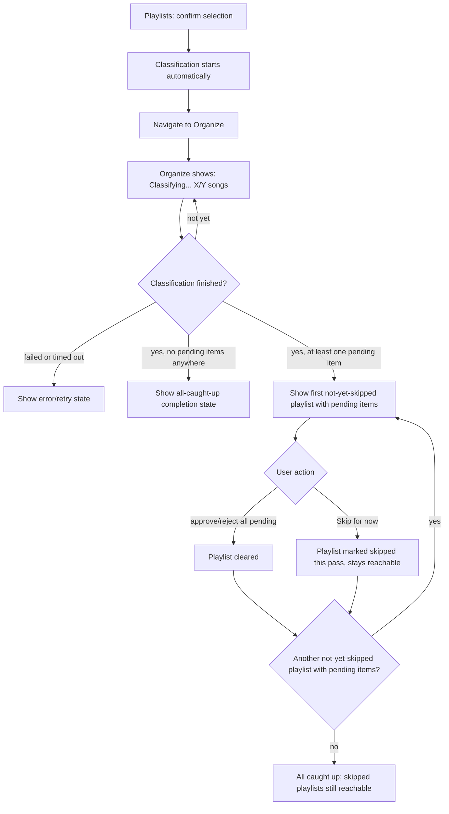
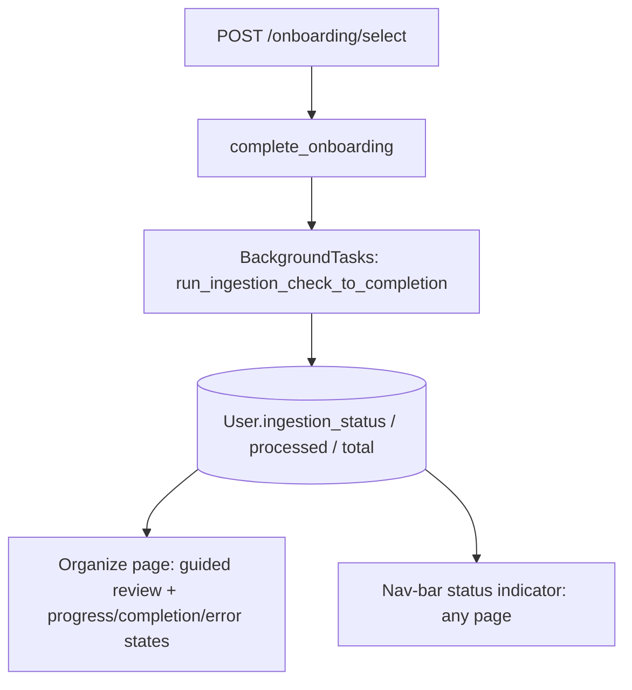

# Playlists and Organize Flow - Plan

## Goal Capsule

- **Objective:** Restructure the app's primary navigation and flow around two renamed pages — "Playlists" (first page, playlist setup) and "Organize" (guided, one-playlist-at-a-time review) — and close the gap where finishing setup doesn't visibly start classification.
- **Product authority:** This plan owns navigation structure, page naming, the Organize review flow's presentation, and background-classification triggering/visibility. It does not own backend classification logic (rules, artist-similarity, description-match), the `trigger_reorganize` concurrency-guard bug, or the Settings/auth flows.
- **Open blockers:** None.
- **Product Contract preservation:** changed — added R15, R16. Planning surfaced two genuine product-scope forks left open by the doc review (whether to fix the stale-session bug now, and where a returning user with pending work lands); both were resolved with the user before this plan was written and are recorded as new requirements rather than silently assumed.

## Product Contract

### Summary

Onboarding is renamed "Playlists" and becomes the app's first page; Review Queue is renamed "Organize" and switches from showing every playlist's queue at once to a guided, one-playlist-at-a-time review. Confirming playlist selection automatically starts classification and takes the user straight into that guided review, with a small always-visible status indicator so background progress is never invisible from other pages.

### Problem Frame

Today, Review Queue — not Onboarding — is the app's default landing page, and it already groups pending items by playlist (`groupByPlaylist`), but every playlist's section renders simultaneously on one long scrolling page rather than one at a time.

Finishing playlist selection on Onboarding does not reliably start classification. `runFinish()` only triggers matching automatically when a Reorganize session happens to be open (`web/src/pages/Onboarding.tsx:391-400`); a normal first-time user who confirms their playlists lands on Review Queue and sees "Nothing to review right now," with no indication they still need to find and click "Load new songs" themselves.

Background progress is also tied to whichever page happens to be mounted: ingestion and matching progress only poll and render while Review Queue is open, so a user who navigates to Settings mid-run gets no feedback until they navigate back. Separately, two independent pipelines — Onboarding's own initial suggestions and the Reorganize action's full re-cluster — both propose new playlists from the same library with no shared awareness of each other, which produced a real, observed bug this session: a stale browser-local reference to a deleted Reorganize session silently suppressed Onboarding's own suggestions from ever appearing.

### Key Decisions

- **KD1. Rename both pages and close the real gaps, not just relabel them** (session-settled: user-directed — chosen after weighing a rename-only version, this plus real-gap fixes, and a bigger "persistent status is the primary object" reframe). Fixes the silent "nothing to review" gap left by the current flow. Governs R4, R5.
- **KD2. Guided sequential review, one playlist at a time** (session-settled: user-directed — chosen over a free-jump list defaulting to the next incomplete playlist). Matches the "see first playlist, approve, go on" framing directly. Governs R6.
- **KD3. Explicit "Skip for now" per playlist, not strict clear-before-advance** (session-settled: user-directed). A playlist with many pending items should not block progress through the rest. Governs R7.
- **KD4. Auto-navigate to Organize with live progress immediately after confirming selection** (session-settled: user-directed — chosen over staying on Playlists with a banner and a manual "Go to Organize" action). Removes the extra click between finishing setup and seeing progress. Governs R5.
- **KD5. Reorganize stays a separate, explicitly-triggered action, not merged into Playlists' own suggestion engine** (session-settled: user-approved — proposed given Reorganize's session-scoped preview/cancel/apply model is real, deliberate value for re-analyzing an already-organized library, with nothing analogous needed for first-time setup; the user assented by choosing this shape). Governs R11.
- **KD6. A playlist with zero pending items after classification is skipped automatically in the guided sequence** (session-settled: user-approved — proposed as a call-out, confirmed). It is never shown as an empty stop requiring action, and re-enters the sequence automatically (no separate manual step) once ongoing use gives it pending items. Governs R8.
- **KD7. Reorganize-sourced review items flow through the same per-playlist Organize view as regular backfill items; only the session-level Cancel/Finish & Apply controls stay separate** (session-settled: user-approved — proposed as a call-out, confirmed). Governs R12.

### Actors

- A1. The user — the single person operating their own connected YouTube Music account through this app.

### Requirements

**Navigation & entry point**

- R1. The page currently named Onboarding is renamed "Playlists" and becomes the app's first/default page.
- R2. The page currently named Review Queue is renamed "Organize".
- R3. Top navigation order is Playlists, Organize, Settings.

**Automatic classification trigger**

- R4. Confirming playlist selection on Playlists automatically starts library classification in the background, without a separate manual "Load new songs" action — both for first-time setup and for any later visit where the user re-confirms their selection (e.g. adding or removing a playlist).
- R5. Immediately after confirming playlist selection, the app navigates to Organize, which shows live classification progress until at least one playlist has a pending item ready for review.

**Guided per-playlist review**

- R6. Organize presents one playlist's pending items at a time rather than every playlist's queue simultaneously.
- R7. A playlist with pending items can be explicitly skipped without clearing it; a skipped playlist remains reachable rather than dropped from view, but is not immediately re-shown by the guided sequence's own auto-advance within the same pass — only by explicitly revisiting it.
- R8. A playlist with zero pending items after classification is skipped automatically in the guided sequence; if it later gains pending items through ongoing use, it's picked up the same way any playlist with pending items is, with no separate manual step required.
- R9. Approving, rejecting, and reassigning items within a playlist behaves the same as today's per-item actions; only the page-level presentation changes from all-playlists-at-once to one-playlist-at-a-time.

**Background status visibility**

- R10. A persistent, small status indicator in the shared navigation shell shows live background classification/matching progress (or a "ready to review" signal) regardless of which page is currently open.

**Reorganize stays distinct**

- R11. The Reorganize action (full-library re-fetch and re-cluster) remains a separate, explicitly-triggered action reachable from Playlists, not merged into Playlists' own initial-suggestion generation.
- R12. Review items produced by a Reorganize session appear within the same per-playlist guided Organize view as regular backfill items; the session-level Cancel and Finish & Apply controls remain a distinct, visible affordance rather than being duplicated per playlist.

**Completion and error states**

- R13. If classification finishes and no playlist has any pending items, Organize shows an explicit "all caught up" completion state instead of remaining on the progress view.
- R14. If background classification or matching fails or times out, the status indicator and Organize show an explicit error/retry state rather than appearing to hang indefinitely.

**Returning-user landing and session hygiene**

- R15. A browser-local Reorganize session reference that no longer resolves server-side is cleared rather than continuing to suppress Playlists' own suggestion generation.
- R16. On app load, if the user has any pending Organize items, the app opens directly to Organize instead of Playlists; Playlists is the default landing only when nothing is pending.

### Key Flows

- F1. First-time setup through first review
  - **Trigger:** The user confirms playlist selection on Playlists for the first time.
  - **Actors:** A1
  - **Steps:** Classification starts automatically in the background; the app navigates to Organize, which shows live progress; once any playlist has pending items, Organize shows the first one for guided review, skipping any playlist that ends up with zero pending items. If classification finishes with no pending items anywhere, Organize shows an all-caught-up completion state instead. If classification fails or times out, Organize shows an error/retry state instead of an indefinite progress view.
  - **Covers:** R1, R4, R5, R6, R8, R13, R14

- F2. Guided review across multiple playlists
  - **Trigger:** Organize is showing a playlist with pending items.
  - **Actors:** A1
  - **Steps:** The user approves, rejects, or reassigns items in the current playlist, or explicitly skips it; once the playlist is cleared or skipped, Organize advances to the next playlist with pending items; skipped playlists remain reachable.
  - **Covers:** R6, R7, R9

- F3. Re-running Reorganize later
  - **Trigger:** An already-onboarded user triggers Reorganize from Playlists.
  - **Actors:** A1
  - **Steps:** Reorganize's existing full re-fetch/re-cluster/matching pipeline runs as today (session-scoped, deferred-write); resulting review items surface inside the same per-playlist Organize view; the session's Cancel/Finish & Apply controls stay visible separately from the per-playlist actions.
  - **Covers:** R11, R12

- F4. Returning to the app with work already pending
  - **Trigger:** The user opens the app after a prior visit left Organize items pending, or after a Playlists visit whose Reorganize session id no longer resolves server-side.
  - **Actors:** A1
  - **Steps:** The app checks for pending Organize items on load and opens directly to Organize when any exist, bypassing Playlists; separately, if a stored Reorganize session reference no longer resolves, it's cleared and Playlists' own suggestion generation runs instead of staying silently suppressed.
  - **Covers:** R15, R16

### Acceptance Examples

- AE1. Given a user just confirmed playlist selection for the first time, when classification finishes finding pending items for 3 of the 5 selected playlists, then Organize shows the first of those 3 for review and the other 2 (zero pending) never appear as a stop in the sequence. **Covers R5, R6, R8.**
- AE2. Given the user is reviewing a playlist with 40 pending items, when they choose "Skip for now" without approving or rejecting any of them, then Organize advances to the next playlist with pending items and the skipped playlist remains reachable. **Covers R7.**
- AE3. Given classification is still running in the background, when the user navigates to Settings, then the persistent status indicator in the navigation shell still shows live progress. **Covers R10.**
- AE4. Given a Reorganize session is open and has produced pending review items for an existing playlist, when the user reaches that playlist in Organize's guided sequence, then its items appear like any other pending items, and the session's Cancel/Finish & Apply controls are visible separately rather than duplicated inline per item. **Covers R12.**
- AE5. Given a user just confirmed playlist selection, when classification finishes and none of the selected playlists has any pending items, then Organize shows an explicit all-caught-up completion state rather than remaining on the progress view. **Covers R13.**
- AE6. Given classification is in progress, when the background job fails or times out, then Organize and the persistent status indicator show an explicit error/retry state instead of appearing to hang indefinitely. **Covers R14.**
- AE7. Given a browser still holds a Reorganize session id whose server-side session was since deleted, when the user opens Playlists, then the stale reference is cleared and Playlists' own suggestion generation runs instead of staying suppressed. **Covers R15.**
- AE8. Given a user has pending items in Organize from a prior visit, when they open the app, then it opens directly to Organize; given they have no pending items, when they open the app, then it opens to Playlists. **Covers R16.**

### Scope Boundaries

**Deferred for later:**

- Fixing `trigger_reorganize`'s missing concurrency guard (found and diagnosed this session — every other trigger endpoint rejects a double-trigger while already running; this one doesn't). Tracked as a separate bug fix from this navigation/flow restructuring.
- Merging Onboarding's own suggestion-generation pipeline and Reorganize's clustering into one literal pipeline — kept distinct per KD5.
- A formal multi-step "wizard" UI component or framework — the guided sequential flow does not need one.

### Dependencies / Assumptions

- Existing backend gating — ingestion backfill only runs once `onboarding_completed_at` is set — stays in place; this plan changes what triggers the check (automatic on confirming selection, instead of a manual "Load new songs" click) and where the user is navigated afterward, not the gate itself.
- The existing browser-local Reorganize session id, used to resume a session's progress across page navigations, continues to work as it does today; the new persistent status indicator is additive to it, not a replacement.
- Backend classification signals (rule matching, artist-similarity, description-match) and the review-item data model are unchanged by this plan — this is a navigation, flow, and triggering restructuring, not a classification-logic change.

This plan carries no unresolved Outstanding Questions: playlist ordering, the skipped-playlist revisit interaction, and the status indicator's placement are resolved in the Planning Contract below (KTD5, U5, KTD4 respectively); the two items previously recorded under Deferred / Open Questions (the stale-session bug and the returning-user landing page) are resolved as R15 and R16 above.

---

## Planning Contract

### Key Technical Decisions

- **KTD1. Page identifiers are renamed alongside their labels** (`'onboarding' → 'playlists'`, `'review' → 'organize'`) while the underlying component file names (`Onboarding.tsx`, `ReviewQueue.tsx`) stay unchanged — a plain-union-type rename is cheap and keeps the id legible, while renaming files would add import churn across the frontend with no behavioral payoff. Governs R1, R2, R3.
- **KTD2. R14's failure detection reuses the existing per-dependency health signal** (`dependency_health_store`) rather than adding a new failure-tracking mechanism (session-settled: user-approved — proposed as a call-out during planning, confirmed). Applied to all three background job types ingestion, proposals/clustering, and matching — R14's wording names "classification or matching," but proposals/clustering shares R10's nav-bar indicator, so leaving it out would make the indicator inconsistent across job types it's meant to cover uniformly. Governs R14.
- **KTD3. Guided-review position and the this-pass skip list persist client-side in a new localStorage utility mirroring `web/src/reorganizeSession.ts`'s shape** (session-settled: user-approved — proposed as a call-out, confirmed), rather than being recomputed statelessly from the queue on every load. Governs R6, R7.
- **KTD4. R10's persistent status indicator extends `Layout.tsx`'s existing header status area** (next to the write-path/detection-path status dots) rather than introducing a separate element (session-settled: user-approved — proposed as a call-out, confirmed). Governs R10.
- **KTD5. Playlist ordering within the guided sequence follows the existing creation/selection order `groupByPlaylist` already yields**, with no new sort (session-settled: user-approved — proposed as a call-out, confirmed). Governs R6.
- **KTD6. The stale-session fix both clears the stored session reference and immediately falls back to triggering Playlists' own suggestion generation for the current page load**, not just future ones (session-settled: user-directed — chosen over clearing-only, which would only fix future visits and leave the current one still suppressed). Governs R15.
- **KTD7. The returning-user auto-redirect reuses the existing review-queue fetch already made on mount** rather than a new dedicated endpoint (session-settled: user-directed — chosen over always landing on Playlists and relying solely on the nav-bar indicator). Governs R16.
- **KTD8. R4's later-re-confirm coverage needs no new code path**: `POST /onboarding/select` already handles both first-time creation and later edits through the same `complete_onboarding` call, so a single unconditional background-task trigger satisfies both without branching. Governs R4.

### High-Level Technical Design

The auto-trigger path fans out from one backend call into two independent UI consumers that both read the same status fields — worth a diagram since it's the shape U2, U3, U5, and U7 all key off:

Proposals (`run_propose_new_playlists`) and Reorganize matching (`run_reorganize_matching`) follow the same shape independently, each writing their own status fields (`proposals_status`, `matching_status`) that the nav-bar indicator (U7) and Organize (U5) read the same way.

---

## Implementation Units

### U1. Rename navigation labels and page identifiers

- **Goal:** Rename Onboarding → "Playlists" (first/default page) and Review Queue → "Organize" in the nav shell, and rename their internal page-id values to match.
- **Requirements:** R1, R2, R3
- **Dependencies:** None
- **Files:** `web/src/App.tsx`, `web/src/components/Layout.tsx`, `web/tests/Layout.test.tsx`
- **Approach:**
  1. In `Layout.tsx`, rename the `Page` type values (`'onboarding' → 'playlists'`, `'review' → 'organize'`) and the `NAV_ITEMS` array's labels ("Playlists", "Organize"); reorder to Playlists, Organize, Settings.
  2. In `App.tsx`, update the renamed page-id checks; keep the imported component names (`Onboarding`, `ReviewQueue`) as-is (KTD1).
  3. Initial page state stays a placeholder here — U6 wires the conditional (pending-work-aware) initial value.
- **Patterns to follow:** the existing `NAV_ITEMS`/`Page` union shape already in `Layout.tsx`.
- **Test scenarios:**
  - Nav renders "Playlists", "Organize", "Settings" in that order.
  - Clicking each nav button switches to the renamed page id and highlights it active.
- **Verification:** `Layout.test.tsx` passes; both renamed pages still mount their existing components correctly.

### U2. Backend: auto-trigger classification on confirming playlist selection

- **Goal:** `/onboarding/select` starts library classification automatically, for both first-time setup and later re-confirms.
- **Requirements:** R4
- **Dependencies:** None
- **Files:** `backend/app/api/v1/onboarding.py`, `backend/tests/test_api_routes.py`
- **Approach:**
  1. Add `background_tasks: BackgroundTasks` to `select()`'s signature.
  2. After `service.complete_onboarding(...)` succeeds, call `background_tasks.add_task(run_ingestion_check_to_completion, user.id)`.
  3. No first-time-vs-later branching needed (KTD8).
- **Patterns to follow:** `trigger_proposals` in the same file already calls `background_tasks.add_task(run_propose_new_playlists, ...)` right after its own synchronous pre-flight.
- **Test scenarios:**
  - `POST /onboarding/select` triggers the background task, with `run_ingestion_check_to_completion` patched per this codebase's test-safety convention (never leave `classification_service`/`engine` unset in a test).
  - A later `POST /onboarding/select` call on an already-onboarded user also triggers it (covers R4's later-visit extension).
- **Verification:** `test_api_routes.py`'s onboarding-select tests pass; live check confirms selection starts a real ingestion run with no manual "Load new songs" click.

### U3. Backend: failed-run detection for ingestion, proposals, and matching

- **Goal:** distinguish a genuinely failed background run from one that legitimately found nothing.
- **Requirements:** R14
- **Dependencies:** None
- **Files:** `backend/app/jobs/ingestion.py`, `backend/app/services/library_analysis.py`, `backend/app/jobs/reorganize_matching.py`, `backend/tests/test_ingestion.py`, `backend/tests/test_library_analysis.py`, `backend/tests/test_reorganize_matching.py`
- **Approach:**
  1. In each run-to-completion loop, before the final status write, check the relevant `dependency_health_store` entry (`youtube_detection` for ingestion/matching, `llm_clustering` for proposals).
  2. If DEGRADED and the run made no real progress, set status to `"failed"` instead of `"done"` (KTD2). No schema change — status fields are plain strings already.
- **Patterns to follow:** the existing `dependency_health_store.set_status("youtube_detection", DependencyStatus.DEGRADED, ...)` call already made on `get_liked_songs()` failure.
- **Test scenarios:**
  - A run where `get_liked_songs()` fails every call ends `ingestion_status == "failed"`, not `"done"`.
  - A run that legitimately finds zero new songs (healthy fetch, nothing new) still ends `"done"` (regression guard).
  - Same two scenarios mirrored for `proposals_status` and `matching_status`.
- **Verification:** existing degrade-gracefully tests extended with a `status == "failed"` assertion; no currently-passing `"done"` case changes outcome.

### U4. Frontend: fix stale Reorganize-session suggestion suppression

- **Goal:** a dead browser-local Reorganize session reference no longer blocks Playlists' own suggestion generation.
- **Requirements:** R15
- **Dependencies:** None
- **Files:** `web/src/reorganizeSession.ts`, `web/src/pages/Onboarding.tsx`, `web/tests/Onboarding.test.tsx`
- **Approach:**
  1. Extract the existing "trigger onboarding's own proposals if idle" block (today only reached when no session is stored) into a small helper callable from a second call site.
  2. In the mount-time `pollReorganizeStatus(sessionId).catch(...)` handler (today only clears React state), also call `clearStoredReorganizeSessionId()` and invoke that helper (KTD6).
- **Patterns to follow:** the existing `clearStoredReorganizeSessionId()` call already used on `clustering_status === "cancelled"` in the same file.
- **Test scenarios:**
  - Mount with a stored session id whose status poll rejects (simulated 404): asserts `clearStoredReorganizeSessionId` was called and the onboarding-proposals trigger fired for the current mount.
  - Mount with a stored session id whose poll succeeds: the cleanup path does NOT fire (regression guard).
- **Verification:** `Onboarding.test.tsx` covers both cases; live check confirms deleting a real Reorganize session makes Playlists show suggestions again without a page reload.

### U5. Frontend: guided one-playlist-at-a-time Organize view

- **Goal:** Organize shows one playlist's pending items at a time with skip/advance/revisit, plus completion and error terminal states.
- **Requirements:** R6, R7, R8, R9, R12, R13, R14
- **Dependencies:** U1, U3
- **Files:** `web/src/pages/ReviewQueue.tsx`, `web/src/organizeSkipState.ts` (new), `web/tests/ReviewQueue.test.tsx`
- **Approach:**
  1. New `organizeSkipState.ts` localStorage utility (mirrors `reorganizeSession.ts`'s shape, KTD3) tracking this-pass's skipped playlist ids.
  2. `groups` (from the existing `groupByPlaylist`) already excludes any playlist with zero pending items and recomputes live on every poll/reload, so R8's auto-skip and auto-recovery need no new filtering logic.
  3. Derive the guided sequence's next unresolved playlist as the first `groups` entry (existing order, KTD5) not in the skip set; render only that group instead of mapping every group.
  4. Add a "Skip for now" action per playlist header that adds the id to the skip set and advances to the next unresolved group.
  5. Add a compact "playlists still pending" list (names + counts, reusing Onboarding's checklist-row style) so a skipped playlist can be jumped to directly.
  6. Extend the existing `ingestionStatus === "in_progress"` progress block with two terminal branches: done with zero pending anywhere renders an all-caught-up state (R13); `"failed"` (from U3) renders an error/retry state offering "Load new songs" again (R14).
  7. Existing per-item approve/reject/add-to-playlist actions and the Reorganize session's Cancel/Finish & Apply banner are untouched (R9, R12) — only the page-level grouping presentation changes.
- **Patterns to follow:** `groupByPlaylist` and the existing per-group "Approve all" section; the checklist-row rendering in `Onboarding.tsx` for the revisit list.
- **Test scenarios:**
  - Multiple playlists with pending items: only the first (existing order) renders; others don't appear.
  - "Skip for now" advances to the next unresolved playlist; the skipped one appears in the revisit list.
  - Clearing the current playlist's last item advances the same way as an explicit skip.
  - A playlist with zero pending items never appears as a stop (covers AE1/R8).
  - `ingestion_status: "done"`, zero pending anywhere renders the all-caught-up state, not a group list. Covers AE5.
  - `ingestion_status: "failed"` renders the error/retry state with a working retry action. Covers AE6.
  - Existing approve/reject/add-to-playlist and Reorganize session Cancel/Finish & Apply behaviors are unchanged. Covers AE4.
- **Verification:** `ReviewQueue.test.tsx` covers every scenario above; manual check against the real account confirms the guided flow and revisit list.

### U6. Frontend: auto-navigate into Organize and auto-redirect returning users

- **Goal:** confirming playlist selection lands directly on Organize with live progress; a returning user with pending work skips Playlists entirely.
- **Requirements:** R5, R16
- **Dependencies:** U1, U2, U5
- **Files:** `web/src/pages/Onboarding.tsx`, `web/src/App.tsx`, `web/tests/Onboarding.test.tsx`, `web/tests/App.test.tsx` (or equivalent)
- **Approach:**
  1. In `runFinish()`, after `submitOnboardingSelection` succeeds, navigate straight to Organize (via `onComplete`) instead of the current 1.5s "done" pause — Organize's extended progress block (U5) already carries the "Classifying..." state.
  2. In `App.tsx`, compute the initial page from the existing review-queue fetch already made on mount (KTD7): pending items present → initial page is Organize; otherwise Playlists.
- **Patterns to follow:** the existing `fetchReviewQueue()` call already made in `ReviewQueue.tsx`'s own mount effect.
- **Test scenarios:**
  - Completing playlist selection navigates to Organize (not back to Playlists) and shows live progress there. Covers AE8 (partial).
  - App load with pending Organize items renders Organize first, without visiting Playlists. Covers AE8.
  - App load with no pending items renders Playlists first (regression, covers R1).
- **Verification:** `Onboarding.test.tsx`/`App.test.tsx` cover all three; manual first-time-setup walkthrough confirms no intermediate "done" screen before Organize appears.

### U7. Frontend: persistent nav-bar status indicator

- **Goal:** a small always-visible indicator in the nav shell shows live background classification/matching progress or a ready-to-review signal, from any page.
- **Requirements:** R10
- **Dependencies:** U1, U3
- **Files:** `web/src/components/Layout.tsx`, `web/tests/Layout.test.tsx`
- **Approach:**
  1. Extend `Layout.tsx`'s existing header status area (next to the write-path/detection-path status dots, KTD4) with an element polling ingestion/proposals/matching status independently of whichever page is mounted, mirroring the existing `fetchAuthStatus()` poll-on-mount.
  2. Render states: in-progress (compact progress text), ready-to-review (count of playlists with pending items), failed (from U3), idle (nothing shown).
- **Patterns to follow:** `Layout.tsx`'s existing `useEffect`-driven `fetchAuthStatus()` poll and status-dot rendering.
- **Test scenarios:**
  - Indicator shows progress while a background run is in progress, independent of which page is active. Covers AE3.
  - Indicator shows a failed state when the relevant status is `"failed"`.
  - Indicator is silent when everything is idle.
- **Verification:** `Layout.test.tsx` covers all three states; manual check that navigating away from Organize mid-run still shows progress in the nav bar.

---

## Verification Contract

| Scope | Command | Applies to |
|---|---|---|
| Backend unit/integration tests | `.venv/bin/python -m pytest -q` (run from `backend/`) | U2, U3 |
| Frontend unit tests | `npm test` (runs `vitest run`, from `web/`) | U1, U4, U5, U6, U7 |
| Live walkthrough | Manual: reset onboarding state (as done earlier this session), confirm playlist selection, watch the auto-trigger → Organize → guided review → nav-bar indicator sequence end to end against the real account | F1-F4, all units |

No `release:validate`-equivalent gate exists in this repo; the two test commands above plus the live walkthrough are the full quality bar.

---

## Definition of Done

- Every implementation unit (U1-U7) is implemented and its test scenarios pass.
- `.venv/bin/python -m pytest -q` (backend) and `npm test` (frontend) both pass with no regressions in existing suites.
- No dead code remains from any explored-but-discarded approach.
- A live walkthrough on the real account confirms F1 (first-time setup through first review), F2 (guided review across multiple playlists, including skip/revisit), F3 (Reorganize still works standalone), and F4 (returning with pending work, and stale-session recovery) all behave as specified.
- Every new/changed requirement (R1-R16) has at least one passing test scenario tracing back to it.
